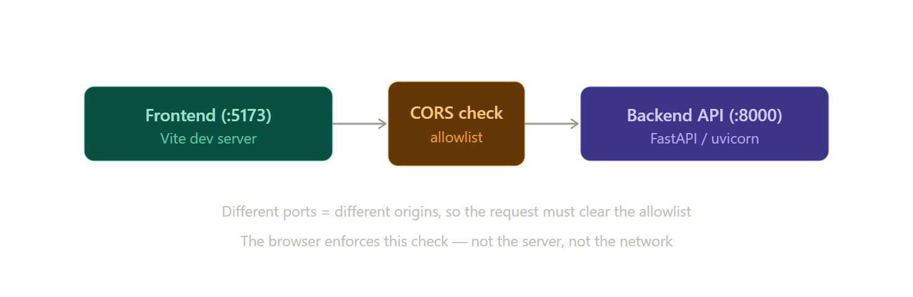

# URLs, Ports, CORS Configuration

Great set of questions — these are exactly the things that feel like magic until they click, and then they're simple. Let me build it up from the URL itself, answer the port question directly (that's the heart of your confusion), then walk through your CORS code, and finally extend all of it to Azure.

## The anatomy of a URL

A URL is just a structured address with named parts. Take:

```
http://localhost:8000/api/metrics?range=30d
└─┬─┘   └───┬───┘ └┬┘ └────┬────┘ └───┬──┘
scheme    host   port    path      query
```

- **Scheme** (`http` / `https`) — the protocol. `https` is `http` plus encryption (TLS).
- **Host** — *which machine*. `localhost` is a name that resolves to your own computer (the IP `127.0.0.1`, called the loopback address). A public host would be a domain like `growlytics.com`.
- **Port** — *which program on that machine*. One computer runs many network programs at once; the port is how the OS knows which one a request is for.
- **Path** and **query** — *which resource* on that program, and parameters for it.

The key idea: the host gets you to the machine, the port gets you to the specific process on it.

## The port, and your 8000 question

This is the part you most want clarified, so directly: **you define it.** It is not assigned by the operating system in the normal case. `8000` *feels* automatic because it's a default baked into common tools, not because something is picking it for you.

When you start a server, you (or its default) choose the port:

```bash
uvicorn main:app --port 8000     # you set it explicitly
uvicorn main:app                 # no flag → uvicorn's built-in default, which is 8000
python -m http.server            # Python's built-in default is also 8000
```

So `8000` keeps showing up because several Python web tools default to it — it's a convention, not a system assignment. You're free to change it to anything. Common defaults you'll recognize: Vite uses `5173`, Create-React-App/Node tools use `3000`, Flask uses `5000`, the generic "alternate HTTP" port is `8080`. None of those are mandatory; they're just each tool's default.

Ports range from `0` to `65535`. Roughly: `0–1023` are "well-known" (`80` for HTTP, `443` for HTTPS) and usually need admin privileges to bind; `1024–49151` are the normal range you'll use for dev servers; the top range is "ephemeral," used automatically for outbound connections.

**Where to find which port is actually in use.** A few reliable ways:

- The server prints it on startup. Uvicorn says something like `Uvicorn running on http://127.0.0.1:8000`. That line is the source of truth.
- From the OS: `lsof -i :8000` (or `ss -ltnp` / `netstat -ano` on Windows) tells you what's listening on a port.
- In your own code, since you supplied it, you already know it — and you can read it back from config or an env var.

There *is* one case where the OS auto-assigns: if you bind to **port 0**, the OS hands you a random free port. And on hosting platforms (Azure, etc.) the platform assigns the port and tells your app via an environment variable — more on that below. But in plain local dev, `8000` is a chosen default, fully under your control.

One related detail: `localhost`/`127.0.0.1` means "only reachable from this machine." If you bind to `0.0.0.0` instead (`uvicorn main:app --host 0.0.0.0`), the server listens on all network interfaces, so other devices on your network can reach it. That host-binding choice is separate from the port choice.

## Now your CORS code

First, the concept the code exists to handle. An **origin** is the triple **scheme + host + port**. Two URLs share an origin only if all three match. So:

```
http://localhost:5173   ← your frontend dev server (Vite)
http://localhost:8000   ← your FastAPI backend
```

These are **different origins** — the port differs. Same machine, same scheme, but different origin. Browsers enforce the **Same-Origin Policy**: JavaScript loaded from one origin is, by default, *not allowed* to read responses from a different origin. So when your frontend page (served from `:5173`) runs `fetch("http://localhost:8000/api/...")`, the browser blocks it unless the backend explicitly says "I permit `:5173` to call me." That permission mechanism is **CORS** (Cross-Origin Resource Sharing).

Critically: **CORS is enforced by the browser, not the server.** The server merely *declares* what it allows by attaching special response headers (`Access-Control-Allow-Origin`, etc.); the browser reads those and decides whether to let your JS see the response. (This is why `curl` or Postman ignore CORS entirely — there's no browser policing them. CORS protects users in browsers, not the server itself.)

Now your code, line by line:

```python
CORS_ORIGINS = os.environ.get(
    "GROWLYTICS_CORS_ORIGINS",
    "http://localhost:5173,http://localhost:3000",
).split(",")
```

This reads an environment variable named `GROWLYTICS_CORS_ORIGINS`. If that variable isn't set, it falls back to the string `"http://localhost:5173,http://localhost:3000"`. Then `.split(",")` turns that comma-separated string into a Python list: `["http://localhost:5173", "http://localhost:3000"]`. So out of the box, with no configuration, it permits the two common local frontend dev servers.

```python
app.add_middleware(
    CORSMiddleware,
    allow_origins=config.CORS_ORIGINS,
    allow_methods=["GET"],
    allow_headers=["*"],
)
```

This installs FastAPI's CORS middleware. `allow_origins` is the allowlist — only those origins get the "you may read my responses" headers. `allow_methods=["GET"]` says cross-origin callers may only use GET (no POST/PUT/DELETE from the browser). `allow_headers=["*"]` permits any request headers. When a browser is about to make certain cross-origin requests, it first sends a small "preflight" `OPTIONS` request asking what's allowed; this middleware answers it.

The reason origins come from an **environment variable with a localhost fallback** is the punchline that connects to Azure: it lets the *same code* work in local dev (uses the fallback) and in production (you override the variable) without editing the source. Hold that thought.

Here's the whole local picture, and how it changes in production:  
Here's what's happening on your machine right now, and it's the picture the CORS code exists to manage:



## Extending all this to Azure

When you deploy to a host like Azure App Service, three things change: who picks the port, what the public URL looks like, and what your CORS allowlist must contain.

**The port stops being yours to pick — the platform assigns it and tells your app.** Locally you wrote `--port 8000`. In production, the platform runs many apps and decides which internal port each one should listen on, then passes that value to your process through an environment variable (commonly `PORT`, or `WEBSITES_PORT` when you deploy a container). Your app's job is to *read* it rather than hardcode it:

```python
import os
port = int(os.environ.get("PORT", 8000))   # use the platform's port, else 8000 locally
uvicorn.run(app, host="0.0.0.0", port=port)
```

Note `host="0.0.0.0"` here, not `localhost` — the platform's load balancer needs to reach your app from "outside" the process, so you bind to all interfaces. This is the production answer to your original question: yes, the port can be auto-assigned, but only because the platform sets a variable and you choose to honor it. (Exact variable names and startup behavior for Azure can shift over time, so it's worth confirming against current Azure App Service docs when you actually deploy — but the *pattern* of "read the port from an env var" is universal across hosts.)

**The public URL hides the port.** Azure gives you something like `https://growlytics.azurewebsites.net`. There's no `:8000` in it because Azure's front-end accepts the standard HTTPS port (`443`, which browsers assume for `https` and don't display) and then proxies the request to whatever internal port your app is on. So the messy `:8000` you see locally is just the standard port being implicit in production. The scheme also becomes `https` — Azure terminates TLS for you. Later you can map a custom domain like `api.growlytics.com` to the same app.

**Your CORS allowlist must list the production frontend, not localhost.** In production your frontend is no longer served from `http://localhost:5173` — it lives somewhere like `https://growlytics.com` or `https://growlytics.azurewebsites.net`. The browser will refuse the cross-origin call unless the backend's allowlist includes that exact origin (scheme, host, and port all matching — `https://growlytics.com` and `http://growlytics.com` are *different* origins, and a trailing slash or wrong subdomain will also fail).

And this is the whole reason your code was written the way it was. Recall:

```python
CORS_ORIGINS = os.environ.get(
    "GROWLYTICS_CORS_ORIGINS",
    "http://localhost:5173,http://localhost:3000",   # fallback for local dev
).split(",")
```

Locally, no variable is set, so it falls back to the localhost origins and "just works." In Azure, you don't touch the code — you set an Application Setting (Azure's name for an environment variable) called `GROWLYTICS_CORS_ORIGINS` to your real frontend origin, e.g. `https://growlytics.com`. Same binary, different environment, correct behavior in both. That env-var-with-a-dev-fallback pattern is the idiomatic way to handle every value that differs between your laptop and production — the port, the CORS origins, database URLs, API keys, and so on.

So to tie your three questions together: the `8000` is a default you control, not a system assignment; you find the active value in your server's startup log (or by reading the env var the platform hands you); and the CORS middleware is the backend declaring which frontend origins the browser may let talk to it — a declaration you reconfigure per environment through that environment variable.

If it'd help, I can show you a minimal end-to-end example: a tiny FastAPI app plus the exact local run command and the Azure Application Settings you'd set, so you can see the same code behave correctly in both places.