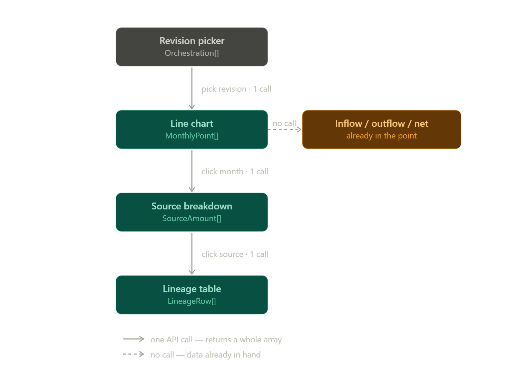

# Webpage and Serving Layer communication

You're right that this is the crux, and I think the fastest way to make it finally click is to *show* you — a real, runnable page where you can watch the data flow and see exactly which array shape feeds which visual, and when a click does or doesn't make a call. Let me explain the patterns clearly and then build you a working demo to study.

Let me check the design guidance before I build the page.The single most useful correction up front: **a chart is filled by one API call that returns the whole array, never one call per point.** Twelve calls to draw a twelve-point line would be twelve network round trips for one picture. The query returns all the points at once, and the chart library loops the array for you. Let me give you the full pattern set, then a working page where you can watch every one of these happen.

## The patterns that decide your query shapes

**The unit of design is a "view," not a data point.** A view is a region of the screen that fills together — the line chart is one view, the breakdown panel is another. Each view is backed by exactly one endpoint that returns a complete, ready-to-render collection. So your endpoint count ≈ your view count, and each returns an array.

**A chart eats an array of objects, one object per mark.** Every charting library takes `data={array}` and maps each element to a line vertex or a bar. That's *why* `MonthlyPoint[]` is the right shape: each element is one point on the line. The query's job is to produce that array, pre-aggregated, at the granularity the visual draws. You never ship 997 raw rows to sum in the browser. This gives you a direct visual→shape dictionary: line/area → `[{x, y…}]`; bars → `[{category, value}]`; table → `[{col…}]`; single KPI → one object; dropdown → `[{id, label}]`.

**The frontend holds the selections; the server stays stateless.** "Which month is selected" lives in frontend state. When a selection changes, the frontend fires one fetch with that selection as a parameter and re-renders. The server just answers parameterized questions — it has no idea what "selected" means.

**Include-in-parent vs fetch-on-demand — this resolves your exact example.** You asked: clicking a month to show its inflow/outflow/net — how does that talk to the server? Trick answer: it often *doesn't*. Those three numbers are already inside the `MonthlyPoint` the user clicked, so showing them needs **no call** — the frontend already has the data in hand. A call is only needed for genuinely *new* data: the breakdown **by source**, which the monthly payload doesn't contain. That's the whole design lever — fold small always-wanted detail into the parent payload (instant, call-free drill); leave larger or sometimes-wanted detail out and fetch it lazily on the click.

**Fetch lazily on interaction (avoid both extremes).** Too chatty = many tiny calls (the 12-call mistake, or fetch-a-list-then-one-call-per-item). Too chunky = one giant upfront payload with all levels, most of which the user never opens. The sweet spot, which your drill-down naturally is: load the chart now; load the breakdown when a month is clicked; load lineage when a source is clicked.

**Three render states per fetch: loading, data, empty/error.** This lightly shapes the API. An empty-but-valid result is `200 []` (the UI shows "no data"); a nonexistent resource is `404`. That's the deliberate split in your code: `/monthly` 404s for an unknown orchestration, but `/sources` returns `[]` for a month with no streams.

**Cache by parameters.** Data-fetching libraries cache each response under a key built from the endpoint + its params, so re-clicking March serves from cache instead of re-calling. This is a quiet reason your fixed-query-plus-runtime-values design matters: stable parameterized endpoints make clean cache keys.

**Parallel for independent data, waterfall only when dependent.** The client picker and revision picker don't depend on each other → fetch together. Level 1 genuinely can't load before the user picks a month → that's a fine, user-driven waterfall. Avoid *accidentally* serializing calls that could run in parallel.

Now watch all of it run. Let me build the page.I spotted a stray typo in the CSS that I need to fix before this goes out.Let me validate the JavaScript parses cleanly and the data is internally consistent.JS parses fine; my consistency check just had a scoping issue with `eval`. Let me fix that and re-run the data validation.Validated: the JavaScript parses cleanly and the demo's data is internally consistent — every lineage allocation sums back to its stream value, and each month's source totals equal that month's net. Here's the page.Open it in any browser — it's one self-contained file, no server needed. Watch the **wire log** on the right as you interact; it narrates every pattern from the explanation as it happens:

On load, you'll see one `CALL` to `/orchestrations`, then one `CALL` to `/monthly` that returns the whole series, then a `RENDER` noting the chart drew all points from that single array — proving "one view, one call, not one-per-point." Click a point on the line and you'll see two distinct entries: a `NO CALL` (the month's inflow/outflow/net came straight from the clicked point) immediately followed by exactly one `CALL` to `/sources` for the genuinely new breakdown data. Click a bar and one `CALL` to `/lineage` fills the table with the many-to-many fan-out. Change the revision dropdown and you'll see a `STATE` change trigger a fresh `/monthly` call — selection lives in the frontend.

The thing that makes this directly useful to you: the `api` object in the code mirrors your FastAPI endpoints one-to-one, and each method has a comment showing the real `fetch(...)` line it would become. The mock data is shaped exactly like what your real `queries.py` returns. So to point this at your actual backend, you'd replace each method body with its `fetch` call and change nothing else — the renderers already consume the real array shapes.

Read the renderers (`renderChart`, `renderSources`, `renderLineage`) alongside the models in your `schema.py` and you'll see the loop close: each renderer takes one array, and the array's fields are exactly the model's fields. That's the whole relationship you were missing — the visual decides the array, the array is the model, the model is the query.

When you want to take the real step, the natural next move is wiring one actual React (or plain-fetch) page to your running FastAPI, starting with the chart against `/monthly`. Want me to build that against the real endpoints next?


# Deeper Machanics of Rendering and Communication

Now we're at the real mechanics — and the reason this feels hard is that the browser works on a fundamentally different model than Python or Power BI. Let me build that model up, because once it's in place, "where do clicks go," "call vs no-call," and "why React" all answer themselves.

## The core shift: the screen is a live tree, and your data lives somewhere else

In Python you call `plt.plot(df)` and get back a finished image — you hand over the whole frame, the library loops it internally, done. In Power BI a visual is *bound* to a dataset, and the engine silently redraws it whenever a filter changes. Both hide the loop and the redraw from you.

The browser hides nothing. Two separate things exist:

The **DOM** is the page as a live tree of element objects (`<svg>`, `<circle>`, `<div>`…). The browser paints this tree to pixels and keeps it on screen. It's persistent and mutable — you can change a node at any moment and the browser repaints.

Your **data** lives separately, in ordinary JavaScript variables in memory (in the demo, `state.monthly`). 

The crucial fact: **the DOM is a *projection* of your data, not the same thing as your data.** Changing the array in memory does **not** change the screen by itself. Something has to *re-project* the array into DOM elements. That projection is a function you write (or a framework writes): `render(data) → DOM`. This one idea is the whole answer to "how do the values get allocated to the right places" — they don't, automatically; a render function reads the array and places each element.

```
JS memory (source of truth)          the DOM (a projection)            screen
  state.monthly = [ {…}, {…}, {…} ] ──render(data)──► <svg><circle/>…  ──paint──► chart
        ▲                                                                            │
        │   setState(newData) / re-render   ◄──── click handler ◄──── user clicks ───┘
        └────────────── re-run render with new data → DOM rewritten → screen updates
```

Data flows one way into the DOM; user events flow back out; a change re-runs the projection. "Dynamic" is nothing more than *re-running render when the data changes.*

## "Each point has its own coordinates" — that's the render loop, and it uses *all* the data at once

Let me correct one thing directly, because it's the source of the confusion. The points are **not** independently fetched or independently cached. The whole array is in one variable, and the chart's render function loops over *all* of it in one pass, computing each point's coordinates from a **scale function** that maps data-space to pixel-space. From your demo's `renderChart`:

```js
const y = v => H-pad - (v-lo)/((hi-lo)||1)*(H-2*pad);   // a scale: a net value → a pixel y
const dots = data.map((d,i) => `<circle cx="${xs[i]}" cy="${y(d.net)}" .../>`).join("");
```

`xs[i]` and `y(d.net)` are exactly what Power BI's axes do internally — turn a value into a position. The reason each circle "has its own coordinates" is just that the loop computes a position *per datum*; they're all produced together from the single array, in one render. Nothing is independent or piecemeal — it's one array, one loop, one projection.

## Where you enable a user action: attach a listener to the rendered element

Interactivity is added *after* an element is rendered, by attaching an **event listener** to that specific element. The browser then calls your function whenever the user clicks that node. From the demo:

```js
el("chart").querySelectorAll(".pt").forEach(c => {
  const p = data[+c.dataset.i];                 // the datum THIS circle represents
  c.addEventListener("click", () => selectMonth(p));   // ← action enabled here
});
```

The key is the closure: each circle's handler captures `p`, the specific point it stands for. So "where do I enable clicking a monthly point?" → on each rendered point, with a handler that remembers which point it is. That handler is your doorway from "the user did something" back into your code.

## Where you decide call-vs-no-call: *inside* the handler

The handler is just plain code, and the branch you asked about lives there. Some handlers render from data already in memory; some fetch then render; some do both. Your `selectMonth` does both, on purpose:

```js
async function selectMonth(p){
  renderMonthDetail(p);                          // NO CALL — p already holds inflow/outflow/net
  const rows = await api.getSources(orch, p.month);  // CALL — the breakdown is new data
  renderSources(rows);                           // render the fetched array
}
```

The decision rule is exactly what we covered last turn, now located precisely: **inside the handler, ask "is the data I need already in a variable I hold?" If yes → render it (no call). If no → fetch, then render.** That's the entire logic of an interactive view, and it's ordinary `if`/sequence code — nothing framework-specific.

## So where does "caching" come in?

Two different things, worth separating. The array sitting in `state.monthly` is **in-memory state** — that's why clicking around the points you already have is instant and call-free; the data is right there in a variable. That's distinct from **HTTP caching** (last turn's topic), which is about not re-calling the *server* for a request you already made. Here, the in-memory array is the source of truth, and the DOM is a disposable projection you regenerate from it whenever something changes.

## How React fits — and why HTML "already did everything"

You're right that plain HTML/JS did everything. It always can — React ultimately compiles down to the same DOM operations (`createElement`, listeners, etc.). React isn't more *powerful*; it's more *maintainable*, and it brings back the thing you miss from Power BI: **automatic re-projection.**

Look at what you had to do manually in the vanilla demo: build DOM strings, inject `innerHTML`, re-attach listeners every render, and remember to re-run the right render when the right piece of state changes. For three views that's manageable; for a real product (dozens of views, forms, shared selections) that manual bookkeeping is where bugs live — stale handlers, a panel you forgot to update, rebuilding the whole tree when one number changed.

React replaces "imperatively update the DOM" with "**declare the UI as a function of state**." You write what the UI should look like for any given state; when state changes, React re-runs your function and **patches only the DOM that actually differs**. Same data→projection model — but you stop writing the projection plumbing by hand. Here's your `selectMonth` flow in React:

```jsx
function Dashboard({ orch }) {
  const [monthly, setMonthly]   = useState([]);
  const [selected, setSelected] = useState(null);   // the clicked point — in memory
  const [sources, setSources]   = useState(null);

  useEffect(() => { api.getMonthly(orch).then(setMonthly); }, [orch]);  // one call → chart

  async function onPointClick(p) {
    setSelected(p);                                  // NO CALL — re-renders the trio from memory
    setSources(await api.getSources(orch, p.month)); // CALL — re-renders the bars
  }

  return (
    <>
      <LineChart data={monthly} onPointClick={onPointClick} />
      {selected && <MonthTrio point={selected} />}   {/* from memory, no call */}
      {sources  && <SourceBars data={sources} />}    {/* from the fetched array */}
    </>
  );
}

function LineChart({ data, onPointClick }) {
  return (
    <svg>
      {data.map((p, i) => (
        <circle key={p.month} cx={x(i)} cy={y(p.net)} onClick={() => onPointClick(p)} />
      ))}
    </svg>
  );
}
```

Notice what changed and what didn't. The **decision logic is identical** — `onPointClick` still renders the trio from memory (no call) and fetches sources (call); that's your app, not the framework. What disappeared is the plumbing: `data.map` *is* the render loop, `onClick` replaces `addEventListener`, and `setSelected`/`setSources` replace every manual `innerHTML` rewrite — calling a setter changes state, and React automatically re-runs the projection and updates the screen. That's the Power BI feeling — "data changed, view updated" — restored, plus reusable components (`<LineChart>`, `<MonthTrio>`) you can compose.

So the honest summary: for a one-page demo, vanilla is fine and clearer for learning. React earns its place the moment you have real interactivity and shared state, because it removes the manual data↔DOM synchronization that becomes the bug factory — it is the declarative binding layer the raw browser lacks.

If you'd like to *feel* the difference, I can rebuild that same demo as a single runnable React file (CDN-loaded, no build step) so you can put the two side by side — same behavior, and you'll see exactly which lines vanish. Want me to?


# Frontend Crash Course


I'd be happy to help you understand this! Let me first read your demo code so I can tailor the crash course to exactly what you're looking at, rather than giving you generic explanations. 

## First, a reframe that'll save you a lot of confusion

Your file's title says "frontend," and you asked about React — but **this demo doesn't use React at all.** It's plain ("vanilla") JavaScript. That's not a problem; it's actually the best possible thing to learn from, because it shows you the raw machinery that React later hides. Once you understand this file, React will make sense as "the thing that automates the tedious parts I just saw done by hand."

And here's the reassuring part: **you already understand the hard half.** You built a serving layer, FastAPI endpoints, `queries.py`, a SQLite store. The frontend is mostly mechanical translation of arrays into pixels. The concepts you're missing are smaller than you think.

## The four technologies, mapped to things you already know

Think of a web page as having three layers, and one optional helper:

**HTML** is the *nouns* — the structure and skeleton. Every `<div>`, `<select>`, `<table>` in your file is HTML. It's analogous to a schema: it declares *what things exist* on the page, but says nothing about how they look or behave. In your file it's everything between `<body>` and `</body>` (lines 85–139).

**CSS** is the *adjectives* — purely how things look. Colors, spacing, fonts, layout. It's the entire `<style>` block (lines 22–83). Those `--ink`, `--accent` variables at the top are just named constants, exactly like config values. CSS never *does* anything; it only describes appearance.

**JavaScript** is the *verbs* — the behavior and logic. This is the `<script>` block (lines 141–392), and as a backend person this is the layer that'll feel most familiar. It fetches data, transforms arrays, responds to clicks, and rewrites the HTML on the fly. Your file is ~90% JavaScript by importance.

**React** is an optional library that changes *how you write the JavaScript* — specifically the part where you turn data into HTML. Your file does that translation manually (build a string of HTML, shove it into the page). React lets you instead *declare* "this data should look like this," and it figures out the DOM updates for you. You don't need it to understand this file — but I'll show you exactly where it would slot in at the end.

## The one idea this demo is built to teach

Before any code: this entire file exists to hammer home a single principle that lives at the serving-layer/frontend boundary:

> **One view = one array = one API call.** The chart is *one* call that returns all 12 points — not 12 calls. And drilling into data you already fetched costs *zero* calls.

The data flows in a cascade of four levels, and each level down is triggered by a user action. Here's the shape of it:  
Read it. Here's the cascade that the whole demo is built to teach — four levels of data, each one array, each fetched by one call, triggered by one user action:



Now the walkthrough. Your file is helpfully numbered into six regions in the comments — I'll go through them in the order they actually matter, not the order they appear.

## The page skeleton (HTML), once

Before the script runs, the HTML lays out empty containers and gives them IDs: `<select id="orch">`, `<div id="chart">`, `<div id="sources">`, `<div id="log">`, and so on. These are just labeled empty boxes. None of them have content yet — notice the chart starts as `<div class="placeholder">loading…</div>`. The JavaScript's whole job is to find these boxes by their ID and fill them with content built from your arrays. That's the core loop of frontend work: *empty container in the HTML → data fetched → container's contents replaced.*

## Region 1 & 2: the fake database and the API client

`DB` (lines 146–202) is just hardcoded sample data shaped exactly like what your real `queries.py` returns. The `api` object (lines 211–244) is the part to study, because it's pretending to be your FastAPI layer. Look at `getMonthly`:

```javascript
async getMonthly(orch){
  log("call", `GET /forecast/${short(orch)}/monthly …`);
  await wait();
  // REAL APP: return fetch(`/forecast/${orch}/monthly`).then(r=>r.json())
  const rows = DB.monthly[orch] ?? [];
  return rows;
}
```

The commented line is the only thing that changes in your real app. Right now it reads from the `DB` object after a fake delay; in production you swap that one line for a real `fetch()` to your endpoint. Everything else — the chart, the clicks, the rendering — stays identical. That's the demo's promise: the frontend doesn't care whether the array came from a mock object or a real HTTP round trip, as long as the *shape* is the same.

Two things worth naming for a backend person:

`async`/`await` is JavaScript's way of saying "this takes time, don't freeze the page while we wait." `await wait()` pauses this function (not the whole browser) until the fake delay finishes; `await fetch(...)` would pause until the server responds. It's the same idea as awaiting a coroutine — the page stays responsive and the `loading…` placeholder stays visible meanwhile.

The `?? []` ("nullish coalescing") means "if that lookup came back empty/undefined, use an empty array instead." It's what makes the empty-state handling clean downstream.

## Region 3: frontend state — the part your server never sees

```javascript
const state = { orch:null, monthly:[], month:null, source:null };
```

This one line is the conceptual heart of "frontend." Your server is stateless — it answers "give me the sources for *this* month of *this* revision" and forgets you exist. But *which* revision is selected, *which* month was clicked — that lives only in the browser. `state` is that memory. When the user picks a revision, you record it in `state.orch`; when they click a month, `state.month`. The selections drive what gets fetched next, and the server knows nothing about them until you ask it a specific question. This is exactly the comment on line 247: "the selections the server knows nothing about."

## Region 4 & 5: handlers and renderers — the rhythm of every interaction

These two regions are a matched pair, and once you see the rhythm you've basically understood the whole file. Every user action follows the same four beats:

A handler (region 4) does: **change state → show a loading placeholder → fetch the one new array → hand it to a renderer.** A renderer (region 5) does one thing: **turn one array into one chunk of HTML and drop it into its container.** Look at `selectMonth` (handler) calling `renderSources` (renderer):

```javascript
async function selectMonth(point){
  state.month = point.month;            // 1. change state
  renderMonthDetail(point);             //    (inflow/outflow/net — NO fetch, data's in `point`)
  el("sources").innerHTML = `…loading…`;// 2. loading state
  const rows = await api.getSources(state.orch, point.month); // 3. ONE fetch
  renderSources(rows);                  // 4. render the array
}
```

That `renderMonthDetail(point)` line is the demo's punchline made concrete: the inflow/outflow/net numbers are already sitting inside the month object you clicked, so showing them costs zero calls. The amber box in the diagram above is that exact moment.

Now look at how a renderer actually builds HTML — `renderSources`:

```javascript
el("sources").innerHTML = rows.map(r=>`
  <div class="barRow">
    <div class="name">${r.source}</div>
    <button class="bar" data-src="${r.source}">…</button>
    <div class="amt">${money(r.amount)}</div>
  </div>`).join("");
```

This is the single most important pattern in the file, and it's pure data-to-pixels: `.map()` walks the array and turns each row into a string of HTML (using `${...}` to splice values in — that's a "template literal," JS's f-string), `.join("")` glues the strings together, and `.innerHTML = ...` dumps the whole thing into the container. **One array in, one block of markup out.** The chart renderer does the same thing, just emitting SVG `<circle>` and `<polyline>` elements instead of `<div>`s.

The last move in each renderer is wiring up clicks. After the bars exist in the page, the code finds them and attaches a handler: `b.addEventListener("click", ()=>selectSource(b.dataset.src))`. That's how clicking a bar reaches back up and kicks off the *next* fetch in the cascade. The `data-src="..."` attribute is how each button remembers which source it represents — you stash a value on the element when you build it, and read it back when it's clicked.

## Region 6: init — what kicks it all off

```javascript
async function init(){
  const orchs = await api.getOrchestrations();  // top of the cascade
  sel.innerHTML = orchs.map(o=>`<option ...>`).join("");  // fill the dropdown
  sel.addEventListener("change", ()=>selectOrch(sel.value));  // re-fetch on change
  await selectOrch(orchs[0].orchestration_key);  // load the first one
}
init();
```

Nothing happens until `init()` runs on the last line. It fetches the list of revisions, fills the dropdown (same `.map().join()` pattern), wires the dropdown's "change" event to re-fetch, and then loads the first revision so the page isn't empty. From there, every further view is just the user clicking down the cascade.

## Where React would actually change things

Everything above — the manual `.map()` into an HTML string, the `.innerHTML =`, the `addEventListener` after each render — is exactly the boilerplate React exists to remove. In React you'd instead write something closer to "given `state`, here's what the screen should look like," and React diffs the old and new versions and updates only what changed. Your `state` object becomes React state (via a hook called `useState`); your renderer functions become "components" that return markup directly; and you'd never call `addEventListener` by hand — you'd write `onClick={...}` right in the markup. The mental model is the real payoff: this vanilla file does *imperatively* (step by step, by hand) what React does *declaratively* (you describe the end state, it does the steps). Learning it in this order is genuinely the right way around.

If it'd help, I can take any one of these pieces deeper — rewrite this exact demo as a small React version side by side with the vanilla one so you can see the mapping, or zoom in on whichever concept (`async`/`await`, the `.map()` rendering, or the state/event loop) feels shakiest.


# How this code actually executes

A guide to *control flow* in `serving_frontend_demo.html` — how the browser runs the
code, how it waits for the user, and how a click turns into an API call and a redraw.
Written for someone who thinks in Python and finds the jumping-around confusing.

The short version: **a Python script runs top to bottom and exits. This program runs a
brief linear startup, then goes idle and reacts to events forever.** Most of the confusion
disappears once you separate those two phases.

---

## 1. The core mental shift

### Python's model

```python
data = load()        # line 1 runs
result = process(data)  # then line 2
print(result)        # then line 3
# script reaches the end → process exits
```

Execution is a single line moving downward. When it reaches the bottom, the program is
over. If you want input, you *call* `input()` and the whole program blocks on that line
until the user types something.

### This file's model

Two phases:

1. **Startup (linear, Python-like).** The browser runs the `<script>` top to bottom *once*.
   But this phase mostly *defines* things and *registers* what should happen later. The
   actual startup work is one function call at the very bottom: `init();`.

2. **Idle-and-react (event-driven).** After startup, the call stack empties and the program
   **goes to sleep**. It is not "at the end" — it is parked, waiting. A user click or a
   network reply wakes it up, it runs one handler to completion, then goes back to sleep.
   This repeats until you close the tab.

The reason the code "jumps around" is that the order things *run* in is not the order they
appear in the file. Phase 2 is driven by the user, not by line numbers.

---

## 2. Phase 1, step by step: what happens when the file loads

1. The browser reads the HTML top to bottom and builds the page structure (the DOM). At
   this point every container exists but is empty or shows `loading…`.
2. It applies the CSS from `<style>`.
3. It reaches `<script>` and runs it top to bottom.

But running the script top to bottom does **not** do the visible work. Look at what each
part of the script actually is:

```javascript
const DB = { ... };          // defines data. Runs nothing.
const api = { ... };         // defines an object of functions. Runs nothing.
const state = { ... };       // defines a variable. Runs nothing.
async function selectOrch(){ ... }   // DEFINES a function. Does NOT run it.
function renderChart(){ ... }        // DEFINES a function. Does NOT run it.
// ... all the other functions: defined, not run ...
init();                      // <-- THIS is the only line that does work.
```

**Defining a function is not the same as running it.** `function renderChart(){...}` just
files the recipe away under the name `renderChart`. It sits there unused until something
*calls* it with `renderChart(...)`. Ninety percent of the script is definitions; the single
line `init();` at the bottom is the ignition.

(This is also why the code can mention functions that appear later in the file: by the time
`init()` runs on the last line, every function has already been defined.)

---

## 3. The two things that make it non-linear

Two mechanisms break the straight-line flow. Once you can spot them, the file stops being
mysterious.

### 3.1 `addEventListener` = "park this function, call it later"

```javascript
sel.addEventListener("change", () => selectOrch(sel.value));
```

This line **does not run `selectOrch`.** It hands the little function
`() => selectOrch(sel.value)` to the browser and says "keep this; run it whenever the
dropdown changes." Then execution moves immediately to the next line. The parked function
might run in three seconds, three minutes, or never. This is the heart of event-driven
code: you *register* reactions during startup, and they fire later in response to the user.

Every `addEventListener` in the file is one of these "parked reactions." They are the entry
points for Phase 2.

### 3.2 `await` = "pause this function, free up the program, resume later"

```javascript
state.monthly = await api.getMonthly(orch);   // pause here…
renderChart(state.monthly);                   // …this runs only after the data arrives
```

`await` suspends the current function at that line and hands control back to the browser so
the page stays responsive. When the awaited operation finishes (the data arrives), the rest
of the function is scheduled to resume. The line after `await` is therefore *not* run
immediately — it runs later, after a gap. More on the mechanics in section 5.

---

## 4. Single thread + the event loop (how it waits without freezing)

JavaScript in the browser does **one thing at a time** — it is single-threaded. So how can
it "wait for a click" and "wait for the network" without locking up? The answer is the
**event loop**.

Three pieces (these match the diagram):

- **Call stack** — where code actually executes, one function at a time. While something is
  on the stack, *nothing else can run*. When the stack is empty, the page is idle.
- **Task queue** — a waiting room. When the user clicks, or a network reply arrives, or a
  timer finishes, the associated callback is dropped into this queue. It does not run yet.
- **Event loop** — a simple rule running forever: *"If the call stack is empty, take the
  next item from the queue and run it."*

So the lifecycle of any reaction is: something happens in the world → its callback joins the
queue → when the stack is free, the event loop runs that callback to completion → stack
empties → idle again.

**"Run to completion" is important.** Once a handler starts, it runs all the way to its end
before any other queued callback gets a turn. The browser never interrupts a running
function to handle a different click partway through. (This is why the order *inside* one
handler is still perfectly linear and Python-like — it's only *between* handlers that things
are event-driven.)

---

## 5. `async` / `await` in detail

This is the piece most worth understanding, because every data fetch uses it.

### What `await` really does

```javascript
async function selectOrch(orch){
  state.orch = orch;
  el("chart").innerHTML = `<div class="placeholder">loading…</div>`;  // (A)
  state.monthly = await api.getMonthly(orch);                          // (B)
  renderChart(state.monthly);                                          // (C)
}
```

Step by step:

1. Line (A) runs normally — the loading placeholder appears instantly.
2. Line (B): `api.getMonthly(orch)` starts the request and returns a **Promise** — an
   "I'll get back to you later" placeholder. `await` sees the Promise, **suspends
   `selectOrch` right here**, and returns control to the event loop. The function is now
   parked mid-execution. The call stack empties; the page is idle and responsive; the
   `loading…` text stays visible.
3. Some time later the data arrives. Its "resume `selectOrch`" callback joins the queue.
   When the stack is empty, the event loop runs it: `await` produces the resolved array,
   it's stored in `state.monthly`, and execution continues to line (C), which draws the
   chart.

So lines (A), (B), (C) are written in order but run with a **gap** in the middle. That gap
is the whole point — during it, the browser can repaint, and the user could even interact
with other parts of the page.

### Contrast with Python

```python
# Python: this BLOCKS. The whole program stops on this line until the reply comes.
data = requests.get(url).json()
print(data)   # runs immediately after, no gap, but nothing else could happen meanwhile
```

```javascript
// JavaScript: this SUSPENDS just this function. The browser stays alive in the gap.
const data = await fetch(url).then(r => r.json());
renderChart(data);   // runs after the reply, in a later turn of the event loop
```

Same intent ("get data, then use it"), but Python freezes the thread while waiting and JS
frees it. `async`/`await` is JavaScript's way of writing wait-then-continue code that
*reads* linearly while *running* non-blockingly.

### The fake delay in your file

```javascript
const wait = (ms = 320) => new Promise(r => setTimeout(r, ms));
```

`setTimeout(r, ms)` tells the browser "after `ms` milliseconds, drop `r` into the queue."
Wrapping it in a Promise lets the API methods `await wait()` to simulate network latency.
In the real app you delete this and `await` a real `fetch` instead — the suspend/resume
behaviour is identical.

---

## 6. The full trace of your file (the centerpiece)

Here is the complete execution, start to finish, mapped to the wire log you see on the
right of the screen. Watch where the program goes idle — those gaps are the program
*waiting for you*.

**Startup**

1. Browser builds the DOM, applies CSS, runs the `<script>`: defines `DB`, `api`, `state`,
   and all functions. Nothing visible happens yet.
2. Last line runs: `init();`. The call stack now holds `init`.
3. Inside `init`: `await api.getOrchestrations()`.
   → log: `CALL  GET /orchestrations …`
   → `await` **suspends `init`**. Stack empties. **Page idle** during the fake delay.
4. Reply ready → `init` resumes.
   → log: `CALL  ← /orchestrations returned 2 rows`
5. `init` fills the dropdown (`sel.innerHTML = orchs.map(...).join("")`), then
   `sel.addEventListener("change", ...)` — **parks** the change handler (does not run it).
6. `init` calls `await selectOrch(orchs[0]...)` — load the first revision.

**Loading the first chart**

7. Inside `selectOrch`: set `state`, log a `STATE` line, show `loading…` in the chart.
8. `await api.getMonthly(orch)`.
   → log: `CALL  GET /forecast/.../monthly …`
   → suspends `selectOrch`. **Page idle** during the delay.
9. Reply ready → resume.
   → log: `CALL  ← /monthly returned 3 points`
10. `renderChart(state.monthly)` runs: builds the SVG string, assigns it to
    `el("chart").innerHTML`, then `.forEach` attaches a click + keydown listener to **each
    dot** — **parking** those handlers.
    → log: `RENDER  chart drew 3 points`
11. `renderChart` returns → `selectOrch` returns → `init` returns. **The call stack is now
    empty.**

**>>> The program is fully idle here. <<<**
The chart is on screen. No code is running. The program is parked at the bottom-right of
the event-loop diagram, waiting. It will stay exactly like this — for as long as it takes —
until you do something. This is the state a Python script never has.

**You click a dot**

12. The browser drops the parked click handler for that dot into the queue. The event loop
    sees the empty stack and runs it: it calls `selectMonth(p)` where `p` is that dot's
    month object.
13. Inside `selectMonth`: set `state.month`, log a `STATE` line.
14. `renderMonthDetail(p)` runs immediately — **no `await`**, because inflow/outflow/net are
    already inside `p`. The three stat boxes appear instantly.
    → log: `NO CALL  showed inflow/outflow/net — already in the point`
15. Show `loading…` in the sources block, then `await api.getSources(...)`.
    → log: `CALL  GET /forecast/.../sources?month=… …`
    → suspends `selectMonth`. **Page idle again.**
16. Reply ready → resume → `renderSources(rows)` builds the bars and `.forEach` **parks** a
    click handler on each bar.
    → log: `CALL  ← /sources returned N rows`, then `RENDER  breakdown drew N bars`
17. `selectMonth` returns. **Stack empty. Idle again.**

**You click a source bar**

18. Parked bar handler → queue → event loop runs `selectSource(source)`.
19. Set `state.source`, show the lineage card with `loading…`, `await api.getLineage(...)`.
    → log: `CALL  GET /forecast/.../lineage?... …` → suspends → **idle**.
20. Reply → resume → `renderLineage(rows)` builds the table.
    → log: `CALL  ← /lineage returned N rows`, then `RENDER  lineage drew N rows`
21. Returns. **Idle.** Waiting for your next action.

**You change the dropdown** (at any idle moment)

22. The parked `change` handler fires → `selectOrch(sel.value)` → back to step 7 with the
    new revision: reset month/source, re-fetch the chart with one call, redraw.

Notice the rhythm of every interaction is identical: **change state → show loading → await
one fetch → render → go idle.** And every `…` / suspend point in the trace is the program
sleeping, waiting for the world.

---

## 7. Python vs this file, side by side

| Question                          | Python script                     | This browser program                          |
|-----------------------------------|-----------------------------------|-----------------------------------------------|
| How does it start?                | top of file, line 1               | runs `<script>` top to bottom, but real work is `init()` at the end |
| Run order = file order?           | yes                               | only during startup; after that, user-driven  |
| How does it end?                  | reaches the bottom, exits         | never — goes idle and waits until the tab closes |
| Getting input                     | `input()` blocks the program      | register a handler; it fires later, program stays alive |
| Waiting for the network           | `requests.get()` blocks the thread| `await fetch()` suspends one function, frees the program |
| Doing two things "at once"        | threads/async libraries           | single thread + event loop; one handler runs fully at a time |
| What's "between" actions?         | nothing — code is always running  | the program is asleep, stack empty            |

---

## 8. Reading any handler in this file (a practical method)

1. **Find the entry points.** Search the file for `addEventListener` and the bottom-line
   `init()`. Those are the only places execution *starts*. Everything else is reached by
   being called from one of them.
2. **Read each handler top to bottom — it IS linear.** Inside a single function, control
   flow is exactly as straightforward as Python. The only special markers are `await`
   (pause, resume later with the result) and any `addEventListener`/`.forEach(... =>)` that
   parks a *future* reaction.
3. **Treat every `await` as a "…to be continued."** The lines after it run in a later turn
   of the event loop, after the data is back. The program may go idle in between.
4. **Between handlers, assume the program is asleep.** Nothing runs on its own. If something
   happened, a user action or a returning fetch caused it.

---

## 9. Common confusions, cleared up

**"Why does the line after `await` seem to run 'later'?"**
Because it literally does. `await` suspends the function and lets the event loop do other
work; the continuation is queued and runs once the awaited result is ready.

**"Does `await` freeze the browser like Python's blocking call?"**
No. It suspends only the one async function. The call stack empties, the page can repaint,
and other events can still be handled. That's the entire advantage over blocking.

**"What order do the functions run in?"**
During startup: top to bottom, ending at `init()`. After that: whatever order the *user*
acts in. The file's line order stops predicting run order the moment startup finishes.

**"Why can the inflow/outflow/net appear instantly but the source bars take a moment?"**
The trio is already inside the clicked month object, so `renderMonthDetail` runs with no
`await` — instant. The source breakdown is new data, so it needs an `await`ed fetch, which
introduces the idle gap and the `loading…` state.

**"Where does the program 'live' when I'm not doing anything?"**
Parked in the event loop with an empty call stack — the idle state at the bottom of the
diagram. It is ready, not finished.

---

### One sentence to keep

A Python script is a *recipe being cooked once*; this file is a *vending machine that's
been switched on* — set up once, then standing ready, doing nothing until someone presses a
button, serving one request fully, and returning to standby.


# Appendix code

## `serving_frontend_demo.HTML`

```HTML
<!doctype html>
<html lang="en">
<head>
<meta charset="utf-8">
<meta name="viewport" content="width=device-width, initial-scale=1">
<title>Serving layer ↔ frontend: how data shapes drive visuals</title>
<!--
  WHAT THIS IS
  A learning instrument, not the real product. It runs entirely in this one
  file (open it in any browser, no server needed). The `api` object below
  IMITATES your FastAPI endpoints: each method returns the exact array shape
  your real queries.py returns, after a small fake delay so you can see the
  loading state. Everywhere a real fetch would go, a comment shows the real URL.

  WHAT TO WATCH (right-hand "wire log")
    * one VIEW = one CALL returning a whole ARRAY (the line chart is 1 call, not 12)
    * clicking a month to see inflow/outflow/net makes NO call (already in hand)
    * clicking a month to see the SOURCE breakdown makes exactly ONE call
    * loading / empty states
    * changing the revision re-fetches the chart (selection lives in the frontend)
-->
<style>
  :root{
    --ink:#1b2330; --ink-soft:#5b6472; --line:#e3e5ea; --bg:#f4f5f8;
    --card:#ffffff; --accent:#3b4cca;          /* API / calls */
    --in:#1f9e6e; --out:#c2502f; --net:#2a3550; /* inflow / outflow / net */
    --tag-call:#3b4cca; --tag-nocall:#6b7280; --tag-render:#1f9e6e; --tag-state:#9a6b1f;
  }
  *{box-sizing:border-box}
  body{
    margin:0; background:var(--bg); color:var(--ink);
    font-family:system-ui,-apple-system,Segoe UI,Roboto,sans-serif; line-height:1.5;
  }
  .mono{font-family:ui-monospace,SFMono-Regular,Menlo,Consolas,monospace}
  header{padding:22px 28px 6px}
  header h1{margin:0;font-size:20px;letter-spacing:-.01em}
  header p{margin:4px 0 0;color:var(--ink-soft);font-size:13px;max-width:60ch}
  .wrap{display:grid;grid-template-columns:1fr 380px;gap:18px;padding:18px 28px 40px}
  @media(max-width:880px){.wrap{grid-template-columns:1fr}}
  .card{background:var(--card);border:1px solid var(--line);border-radius:12px;padding:16px 18px;margin-bottom:16px}
  .card h2{margin:0 0 2px;font-size:14px;letter-spacing:.01em}
  .endpoint{font-size:11.5px;color:var(--accent);margin:0 0 12px}
  .endpoint b{color:var(--ink-soft);font-weight:600}
  label{font-size:12px;color:var(--ink-soft)}
  select{font:inherit;padding:6px 8px;border:1px solid var(--line);border-radius:8px;background:#fff;margin-left:8px}
  .hint{font-size:11.5px;color:var(--ink-soft);margin:10px 0 0}
  .placeholder{color:var(--ink-soft);font-size:13px;font-style:italic;padding:8px 0}
  /* clickable marks */
  .pt{cursor:pointer}
  .pt:focus-visible{outline:2px solid var(--accent);outline-offset:2px}
  .bar{cursor:pointer}
  .bar:focus-visible{outline:2px solid var(--accent);outline-offset:2px}
  .barRow{display:grid;grid-template-columns:88px 1fr 92px;align-items:center;gap:10px;margin:7px 0}
  .barRow .name{font-size:12.5px}
  .barTrack{height:22px;background:#f0f1f4;border-radius:5px;position:relative;overflow:hidden}
  .barFill{height:100%;border-radius:5px}
  .barRow .amt{text-align:right;font-size:12.5px}
  /* the clicked-month trio: shown with NO call */
  .trio{display:flex;gap:10px;margin:4px 0 2px;flex-wrap:wrap}
  .stat{flex:1;min-width:96px;border:1px solid var(--line);border-radius:9px;padding:8px 10px}
  .stat .k{font-size:10.5px;color:var(--ink-soft);text-transform:uppercase;letter-spacing:.04em}
  .stat .v{font-size:16px;font-weight:600;margin-top:2px}
  .nocall{display:inline-block;font-size:10.5px;color:var(--tag-nocall);border:1px dashed #c7cad1;border-radius:999px;padding:1px 8px;margin-top:8px}
  table{width:100%;border-collapse:collapse;font-size:12px}
  th,td{text-align:left;padding:6px 8px;border-bottom:1px solid var(--line)}
  th{color:var(--ink-soft);font-weight:600;font-size:11px;text-transform:uppercase;letter-spacing:.03em}
  td.num{text-align:right;font-variant-numeric:tabular-nums}
  /* the signature element: the wire log */
  .console{background:#11151d;border-radius:12px;padding:14px 14px 16px;position:sticky;top:18px;height:calc(100vh - 60px);display:flex;flex-direction:column}
  .console h2{color:#cfd3da;font-size:12px;letter-spacing:.06em;text-transform:uppercase;margin:0 0 10px}
  #log{overflow:auto;flex:1;font-size:12px}
  .row{display:flex;gap:8px;padding:3px 0;border-bottom:1px solid #1c222d}
  .row .t{color:#5d6675;min-width:34px}
  .tag{min-width:64px;font-weight:700;font-size:10.5px;align-self:center}
  .tag.call{color:#8a98ff}
  .tag.nocall{color:#9aa3b0}
  .tag.render{color:#5fd6a6}
  .tag.state{color:#e2b259}
  .msg{color:#cdd2db}
  .msg em{color:#8a98ff;font-style:normal}
  .legend{font-size:11px;color:#7b8492;margin-top:10px;line-height:1.7}
  .legend b{color:#cdd2db;font-weight:600}
</style>
</head>
<body>
<header>
  <h1>How data shapes drive the visuals</h1>
  <p>The left is the screen a user sees. The right is the wire — every call (and every
     deliberate non-call) is logged so you can see the patterns happen.</p>
</header>

<div class="wrap">
  <div>
    <!-- TOP OF THE CHAIN: a picker. /orchestrations returns an array too. -->
    <div class="card">
      <h2>Revision</h2>
      <p class="endpoint mono">GET /orchestrations <b>→ Orchestration[]</b></p>
      <label for="orch">Showing</label>
      <select id="orch"></select>
      <p class="hint">Changing this is a frontend state change → it re-fetches the chart below (one call).</p>
    </div>

    <!-- VIEW 1: the line chart. ONE call returns the whole series. -->
    <div class="card">
      <h2>Monthly net cash flow — the chart</h2>
      <p class="endpoint mono">GET /forecast/{orch}/monthly <b>→ MonthlyPoint[]</b> &nbsp;(1 call · whole series)</p>
      <div id="chart"><div class="placeholder">loading…</div></div>
      <p class="hint">Each dot is one element of the array. Click a dot to drill in.</p>
    </div>

    <!-- VIEW 2: clicking a month. Two different mechanisms on purpose. -->
    <div class="card">
      <h2>Selected month</h2>
      <p class="endpoint mono">inflow / outflow / net come from the clicked point — <b>no call</b></p>
      <div id="monthDetail"><div class="placeholder">Click a point on the chart above.</div></div>
      <div id="sourcesBlock" style="display:none;margin-top:14px">
        <p class="endpoint mono">GET /forecast/{orch}/sources?month= <b>→ SourceAmount[]</b> &nbsp;(1 call · all sources)</p>
        <div id="sources"></div>
      </div>
    </div>

    <!-- VIEW 3: clicking a source → lineage. -->
    <div class="card" id="lineageCard" style="display:none">
      <h2>Lineage</h2>
      <p class="endpoint mono">GET /forecast/{orch}/lineage?month=&source= <b>→ LineageRow[]</b> &nbsp;(1 call · all rows)</p>
      <div id="lineage"></div>
    </div>
  </div>

  <!-- THE SIGNATURE ELEMENT: the wire log -->
  <div class="console">
    <h2>Wire log</h2>
    <div id="log"></div>
    <div class="legend">
      <b>CALL</b> a round trip to the API &nbsp; <b>NO&nbsp;CALL</b> data already in hand<br>
      <b>STATE</b> a frontend selection changed &nbsp; <b>RENDER</b> a view drew an array
    </div>
  </div>
</div>

<script>
/* ============================================================================
   1. MOCK DATABASE — the same fixture data your loader put in SQLite.
      In the real app this lives in the store and queries.py shapes it.
   ========================================================================== */
const DB = {
  orchestrations: [
    {orchestration_key:"c0001_2026_3-pre-harvest", revision_name:"3-pre-harvest", client_name:"North Field Co"},
    {orchestration_key:"c0002_2026_1-baseline",    revision_name:"1-baseline",    client_name:"Prairie Acres"},
  ],
  // level 0: one object per month  (this is MonthlyPoint[])
  monthly: {
    "c0001_2026_3-pre-harvest":[
      {month:"2026-01",month_num:1,inflow:120000,outflow:-30000,net:90000},
      {month:"2026-02",month_num:2,inflow:0,     outflow:-25000,net:-25000},
      {month:"2026-03",month_num:3,inflow:280000,outflow:-15000,net:265000},
    ],
    "c0002_2026_1-baseline":[
      {month:"2026-01",month_num:1,inflow:60000,outflow:0,     net:60000},
      {month:"2026-02",month_num:2,inflow:0,    outflow:-12000,net:-12000},
    ],
  },
  // level 1: keyed by "orch|month"  (each value is SourceAmount[])
  sources: {
    "c0001_2026_3-pre-harvest|2026-01":[{source:"fertilizer",amount:-30000},{source:"revenue",amount:120000}],
    "c0001_2026_3-pre-harvest|2026-02":[{source:"fertilizer",amount:-25000}],
    "c0001_2026_3-pre-harvest|2026-03":[{source:"seed",amount:-15000},{source:"revenue",amount:280000}],
    "c0002_2026_1-baseline|2026-01":[{source:"revenue",amount:60000}],
    "c0002_2026_1-baseline|2026-02":[{source:"chemical",amount:-12000}],
  },
  // level 2: keyed by "orch|month|source"  (each value is LineageRow[])
  lineage: {
    "c0001_2026_3-pre-harvest|2026-01|fertilizer":[
      {output_name:"Input Costs",crop_sys:"wheat", input_output_key:"iok_001",revision_name:"3-pre-harvest",stream_value:-30000,perc:0.5,allocated_value:-15000},
      {output_name:"Input Costs",crop_sys:"canola",input_output_key:"iok_002",revision_name:"3-pre-harvest",stream_value:-30000,perc:0.5,allocated_value:-15000},
    ],
    "c0001_2026_3-pre-harvest|2026-01|revenue":[
      {output_name:"Wheat Revenue",crop_sys:"wheat",input_output_key:"iok_001",revision_name:"3-pre-harvest",stream_value:120000,perc:0.6,allocated_value:72000},
      {output_name:"Wheat Revenue",crop_sys:"wheat",input_output_key:"iok_003",revision_name:"3-pre-harvest",stream_value:120000,perc:0.4,allocated_value:48000},
    ],
    "c0001_2026_3-pre-harvest|2026-03|revenue":[
      {output_name:"Wheat Revenue", crop_sys:"wheat", input_output_key:"iok_001",revision_name:"3-pre-harvest",stream_value:200000,perc:0.6,allocated_value:120000},
      {output_name:"Wheat Revenue", crop_sys:"wheat", input_output_key:"iok_003",revision_name:"3-pre-harvest",stream_value:200000,perc:0.4,allocated_value:80000},
      {output_name:"Canola Revenue",crop_sys:"canola",input_output_key:"iok_002",revision_name:"3-pre-harvest",stream_value:80000, perc:1.0,allocated_value:80000},
    ],
    "c0001_2026_3-pre-harvest|2026-03|seed":[
      {output_name:"Input Costs",crop_sys:"wheat", input_output_key:"iok_001",revision_name:"3-pre-harvest",stream_value:-15000,perc:0.5,allocated_value:-7500},
      {output_name:"Input Costs",crop_sys:"canola",input_output_key:"iok_002",revision_name:"3-pre-harvest",stream_value:-15000,perc:0.5,allocated_value:-7500},
    ],
    "c0001_2026_3-pre-harvest|2026-02|fertilizer":[
      {output_name:"Input Costs",crop_sys:"wheat", input_output_key:"iok_001",revision_name:"3-pre-harvest",stream_value:-25000,perc:0.5,allocated_value:-12500},
      {output_name:"Input Costs",crop_sys:"canola",input_output_key:"iok_002",revision_name:"3-pre-harvest",stream_value:-25000,perc:0.5,allocated_value:-12500},
    ],
    "c0002_2026_1-baseline|2026-01|revenue":[
      {output_name:"Canola Revenue",crop_sys:"canola",input_output_key:"iok_002",revision_name:"1-baseline",stream_value:60000,perc:1.0,allocated_value:60000},
    ],
    "c0002_2026_1-baseline|2026-02|chemical":[
      {output_name:"Input Costs",crop_sys:"wheat", input_output_key:"iok_001",revision_name:"1-baseline",stream_value:-12000,perc:0.5,allocated_value:-6000},
      {output_name:"Input Costs",crop_sys:"canola",input_output_key:"iok_002",revision_name:"1-baseline",stream_value:-12000,perc:0.5,allocated_value:-6000},
    ],
  },
};

/* ============================================================================
   2. THE API CLIENT — imitates your FastAPI endpoints.
      Each method = one endpoint = one round trip = returns one whole array.
      Replace the body of each with a real `fetch(...)` and nothing else changes.
   ========================================================================== */
const wait = (ms=320)=>new Promise(r=>setTimeout(r,ms));

const api = {
  async getOrchestrations(){
    log("call", `GET /orchestrations …`);
    await wait(180);
    // REAL APP: return fetch('/orchestrations').then(r=>r.json())
    const rows = DB.orchestrations;
    log("call", `← /orchestrations returned <em>${rows.length}</em> rows (1 call)`);
    return rows;
  },
  async getMonthly(orch){
    log("call", `GET /forecast/${short(orch)}/monthly …`);
    await wait();
    // REAL APP: return fetch(`/forecast/${orch}/monthly`).then(r=>r.json())
    const rows = DB.monthly[orch] ?? [];
    log("call", `← /monthly returned <em>${rows.length}</em> points in <em>one</em> call`);
    return rows;
  },
  async getSources(orch, month){
    log("call", `GET /forecast/${short(orch)}/sources?month=${month} …`);
    await wait();
    // REAL APP: return fetch(`/forecast/${orch}/sources?month=${month}`).then(r=>r.json())
    const rows = DB.sources[`${orch}|${month}`] ?? [];
    log("call", `← /sources returned <em>${rows.length}</em> rows in one call`);
    return rows;
  },
  async getLineage(orch, month, source){
    log("call", `GET /forecast/${short(orch)}/lineage?month=${month}&source=${source} …`);
    await wait();
    // REAL APP: return fetch(`/forecast/${orch}/lineage?month=${month}&source=${source}`).then(r=>r.json())
    const rows = DB.lineage[`${orch}|${month}|${source}`] ?? [];
    log("call", `← /lineage returned <em>${rows.length}</em> rows in one call`);
    return rows;
  },
};

/* ============================================================================
   3. FRONTEND STATE — the selections the server knows nothing about.
   ========================================================================== */
const state = { orch:null, monthly:[], month:null, source:null };

/* ============================================================================
   4. EVENT HANDLERS — each user action: change state, then fetch what's new.
   ========================================================================== */
async function selectOrch(orch){
  state.orch = orch; state.month = null; state.source = null;
  log("state", `selectedOrch = ${short(orch)}  (reset month & source)`);
  hide("sourcesBlock"); hide("lineageCard");
  el("monthDetail").innerHTML = `<div class="placeholder">Click a point on the chart above.</div>`;
  el("chart").innerHTML = `<div class="placeholder">loading…</div>`;   // loading state
  state.monthly = await api.getMonthly(orch);                          // ONE call fills the chart
  renderChart(state.monthly);
}

async function selectMonth(point){
  state.month = point.month; state.source = null;
  log("state", `selectedMonth = ${point.month}`);

  // (a) inflow / outflow / net: ALREADY in the clicked point → NO call.
  renderMonthDetail(point);
  log("nocall", `showed ${point.month} inflow/outflow/net — data was already in MonthlyPoint`);

  // (b) the source breakdown is NEW data → exactly ONE call.
  show("sourcesBlock"); hide("lineageCard");
  el("sources").innerHTML = `<div class="placeholder">loading…</div>`;  // loading state
  const rows = await api.getSources(state.orch, point.month);
  renderSources(rows);
}

async function selectSource(source){
  state.source = source;
  log("state", `selectedSource = ${source}`);
  show("lineageCard");
  el("lineage").innerHTML = `<div class="placeholder">loading…</div>`;  // loading state
  const rows = await api.getLineage(state.orch, state.month, source);
  renderLineage(rows);
}

/* ============================================================================
   5. RENDERERS — each turns ONE array into ONE view.
   ========================================================================== */
function renderChart(data){
  if(!data.length){ el("chart").innerHTML = `<div class="placeholder">No data for this revision.</div>`; return; }
  const W=560,H=240,pad=34;
  const xs = data.map((_,i)=> data.length===1 ? W/2 : pad + i*(W-2*pad)/(data.length-1));
  const vals = data.map(d=>d.net);
  const lo = Math.min(0,...vals), hi = Math.max(0,...vals);
  const y = v => H-pad - (v-lo)/((hi-lo)||1)*(H-2*pad);
  const zero = y(0);
  const line = data.map((d,i)=>`${xs[i]},${y(d.net)}`).join(" ");
  const dots = data.map((d,i)=>`
     <circle class="pt" tabindex="0" role="button"
        aria-label="${d.month}, net ${money(d.net)}"
        data-i="${i}" cx="${xs[i]}" cy="${y(d.net)}" r="6"
        fill="${d.net>=0?'var(--in)':'var(--out)'}" stroke="#fff" stroke-width="2"></circle>
     <text x="${xs[i]}" y="${H-12}" text-anchor="middle" font-size="11" fill="var(--ink-soft)">${d.month.slice(5)}</text>
  `).join("");
  el("chart").innerHTML = `
    <svg viewBox="0 0 ${W} ${H}" width="100%" role="img" aria-label="Monthly net cash flow line chart">
      <line x1="${pad}" y1="${zero}" x2="${W-pad}" y2="${zero}" stroke="var(--line)" stroke-dasharray="4 4"/>
      <polyline points="${line}" fill="none" stroke="var(--net)" stroke-width="2"/>
      ${dots}
    </svg>`;
  // wire up the clicks (each dot is one array element)
  el("chart").querySelectorAll(".pt").forEach(c=>{
    const p = data[+c.dataset.i];
    c.addEventListener("click", ()=>selectMonth(p));
    c.addEventListener("keydown", e=>{ if(e.key==="Enter"||e.key===" "){e.preventDefault();selectMonth(p);} });
  });
  log("render", `chart drew <em>${data.length}</em> points from the array (no per-point calls)`);
}

function renderMonthDetail(p){
  el("monthDetail").innerHTML = `
    <div class="trio">
      <div class="stat"><div class="k">Inflow</div><div class="v" style="color:var(--in)">${money(p.inflow)}</div></div>
      <div class="stat"><div class="k">Outflow</div><div class="v" style="color:var(--out)">${money(p.outflow)}</div></div>
      <div class="stat"><div class="k">Net</div><div class="v">${money(p.net)}</div></div>
    </div>
    <span class="nocall">these three came from the clicked point — no API call</span>`;
}

function renderSources(rows){
  if(!rows.length){ el("sources").innerHTML = `<div class="placeholder">No sources for this month.</div>`; return; }
  const max = Math.max(...rows.map(r=>Math.abs(r.amount)),1);
  el("sources").innerHTML = rows.map(r=>`
    <div class="barRow">
      <div class="name">${r.source}</div>
      <button class="bar barTrack" data-src="${r.source}" aria-label="${r.source}, ${money(r.amount)}">
        <div class="barFill" style="width:${Math.abs(r.amount)/max*100}%;background:${r.amount>=0?'var(--in)':'var(--out)'}"></div>
      </button>
      <div class="amt mono">${money(r.amount)}</div>
    </div>`).join("");
  el("sources").querySelectorAll(".bar").forEach(b=>
    b.addEventListener("click", ()=>selectSource(b.dataset.src)));
  log("render", `breakdown drew <em>${rows.length}</em> bars from the array`);
}

function renderLineage(rows){
  if(!rows.length){ el("lineage").innerHTML = `<div class="placeholder">No lineage rows.</div>`; return; }
  el("lineage").innerHTML = `
    <table>
      <thead><tr><th>Output</th><th>Crop</th><th>Input key</th><th>Revision</th>
        <th class="num">Stream</th><th class="num">%</th><th class="num">Allocated</th></tr></thead>
      <tbody>${rows.map(r=>`<tr>
        <td>${r.output_name}</td><td>${r.crop_sys}</td><td class="mono">${r.input_output_key}</td>
        <td>${r.revision_name}</td><td class="num mono">${money(r.stream_value)}</td>
        <td class="num mono">${(r.perc*100).toFixed(0)}%</td><td class="num mono">${money(r.allocated_value)}</td>
      </tr>`).join("")}</tbody>
    </table>`;
  log("render", `lineage drew <em>${rows.length}</em> rows (the many-to-many fan-out)`);
}

/* ============================================================================
   6. HELPERS + INIT
   ========================================================================== */
function el(id){return document.getElementById(id);}
function show(id){el(id).style.display="block";}
function hide(id){el(id).style.display="none";}
function short(orch){return orch.split("_").slice(-1)[0];}
function money(n){const s=n<0?"-":"";return s+"$"+Math.abs(n).toLocaleString();}

let clock=0;
function log(kind,msg){
  clock++;
  const labels={call:"CALL",nocall:"NO CALL",render:"RENDER",state:"STATE"};
  const row=document.createElement("div");
  row.className="row";
  row.innerHTML=`<span class="t mono">${String(clock).padStart(2,"0")}</span>
                 <span class="tag ${kind} mono">${labels[kind]}</span>
                 <span class="msg">${msg}</span>`;
  const box=el("log"); box.appendChild(row); box.scrollTop=box.scrollHeight;
}

async function init(){
  const orchs = await api.getOrchestrations();         // top of the chain: also an array
  const sel = el("orch");
  sel.innerHTML = orchs.map(o=>`<option value="${o.orchestration_key}">${o.client_name} — ${o.revision_name}</option>`).join("");
  sel.addEventListener("change", ()=>selectOrch(sel.value));
  await selectOrch(orchs[0].orchestration_key);        // load the first revision's chart
}
init();
</script>
</body>
</html>
```