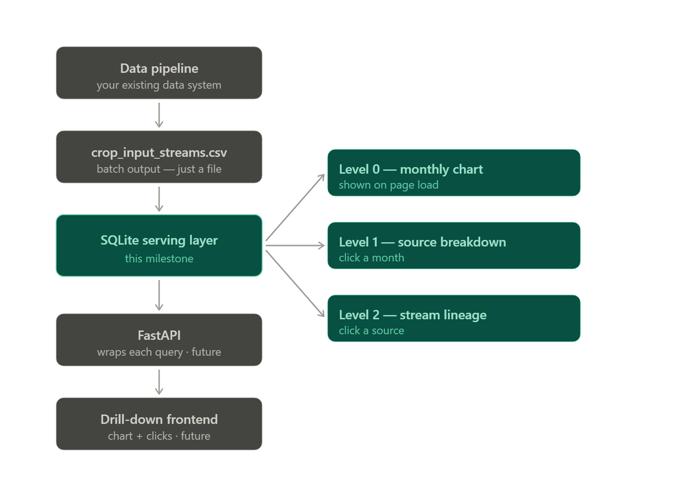
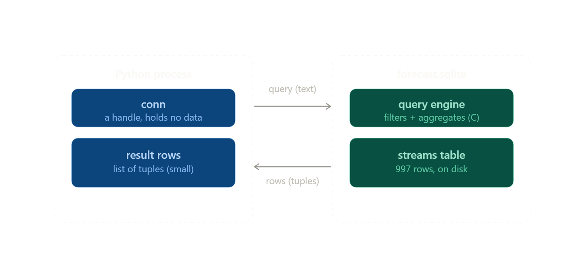
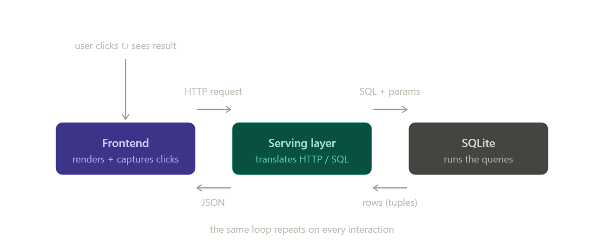
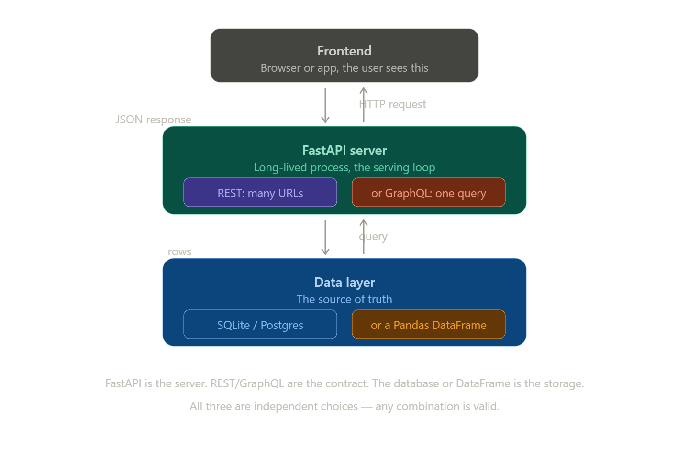

# Concept & Where It Fits

This is a really well-chosen first milestone, and the file's comments hint at why without quite spelling it out. Let me give you the big-picture role first, then go deep on `sqlite3` itself.

Let me sketch where this sits before explaining it.Big picture first. The file you've got is the first brick of what's called the **serving layer** — and understanding that term is the key to seeing why this is milestone zero rather than an afterthought.

Your data system (the pipeline that produced `crop_input_streams.csv`) does *batch* work: it crunches numbers and spits out a file. A file is correct but inert — it just sits on disk. Your frontend, on the other hand, needs to ask narrow questions fast and repeatedly: "just the source breakdown for March, for client c0001." You can't do that against a raw CSV without loading the whole thing into memory and filtering every single time. The serving layer is the stage that sits *between* your pipeline's output and your application, turning that inert file into something you can interrogate quickly. That's exactly what `build_db.py` does.

Here's where it lives in the ecosystem:



Notice the three teal boxes on the right. Those aren't decoration — they're the three functions in your file (`level0_monthly`, `level1_sources`, `level2_lineage`), and each one *is* a frontend interaction in embryo. Level 0 is the chart you see on load; level 1 is what fires when you click a month; level 2 is what fires when you click a source and finally see the individual streams plus the revision that produced them (the "traceability payoff" your comments mention).

That's what makes this the right first step, and why it comes before any API or UI:

The serving layer is a *contract*. By writing these three queries first, you've defined every question the frontend is allowed to ask — before committing to FastAPI, before a single React component. When you build the API next, each endpoint is a thin wrapper around one of these functions. When you build the UI, each click calls one endpoint. You've sequenced the work so the riskiest question ("does my data actually support the drill-downs the product needs?") gets answered cheaply, up front.

And SQLite specifically is chosen to remove distractions. No server to run, no Postgres to install, no credentials, no network. It's one file. So you can focus 100% on getting the query *shape* right. If you later outgrow it, the SQL ports to Postgres almost unchanged — so this milestone is low-commitment as well as low-overhead.

That's the "why." Now the "what" — `sqlite3` from zero.

## What SQLite actually is

SQLite is a relational database **engine**, but with one unusual property: it's *embedded*. "Embedded" means it runs inside your own program rather than as a separate server you connect to over a network. Postgres and MySQL are the opposite — a server process runs somewhere, holds the data, and your code talks to it through a socket with a host, port, username, and password. SQLite has none of that. The entire database — every table, index, and row — lives in a single ordinary file on disk. In your case that file is `forecast.sqlite`. Copy that one file and you've copied the whole database. Delete it and it's gone. That simplicity is why SQLite is the most widely deployed database on Earth (it's inside your phone, your browser, most apps you use).

## What the `sqlite3` module is

The engine itself is written in C. `sqlite3` is the Python module in the standard library that wraps that C engine so you can drive it with Python code. Because it ships with Python, there's nothing to install — that's exactly why your file's comments say the only `pip install` you need is pandas. You just `import sqlite3` and you have a full database at your fingertips.

## The two core objects: Connection and Cursor

Almost everything in `sqlite3` flows through two objects.

A **Connection** is your handle to one database file. You get it with `sqlite3.connect(DB_PATH)`, which opens the file — and *creates* it if it doesn't exist yet. That's the line `conn = sqlite3.connect(DB_PATH)` in your `build()` function. The connection represents the open database; you do all your work through it, and you call `conn.close()` when you're finished to release the file.

A **Cursor** is the object that actually executes a SQL statement and holds the resulting rows. Normally you'd write `cur = conn.cursor()`, then `cur.execute(sql)`, then pull results with `cur.fetchall()` (all rows), `cur.fetchone()` (one row), or by iterating over it. You don't *see* explicit cursors in your file, and that confuses most beginners, so here's the resolution: `conn.execute(...)` is a shortcut. It quietly creates a cursor, runs your statement on it, and returns it. Your `conn.execute("CREATE INDEX ...")` is doing exactly that. So cursors are present — they're just created implicitly for you.

## Parameterized queries — the `?` and `params=[...]`

This is the single most important practical concept in the file, and it appears in all three query functions. Look at `level1_sources`:

```
WHERE orchestration_key = ? AND month = ?    ...    params=[orch, month]
```

The `?` marks are **placeholders**. You never paste the actual values into the SQL string yourself — you hand them separately as `params`, and SQLite slots them in. There are two reasons this matters, and they're both worth internalizing as a reflex:

First, safety. If you instead built the string with an f-string like `f"... month = '{month}'"`, and `month` ever came from a user, a malicious value could break out of the quotes and rewrite your query — that's SQL injection. With placeholders, the value is *always* treated as data, never as part of the SQL command, so injection is impossible.

Second, correctness. SQLite handles the fiddly type and quoting rules for you: strings get quoted, numbers don't, and Python's `None` becomes SQL `NULL`. Doing that by hand is error-prone.

One subtlety you'll notice: the *table name* in your file **is** dropped in with an f-string — `FROM {TABLE}`. Isn't that the thing I just warned against? It's acceptable here only because `TABLE` is a hardcoded constant *you* control, never user input. And it's actually necessary: the `?` placeholder mechanism only works for *values*, not for *identifiers* like table or column names. So the rule of thumb is: `?` for values, always; inject an identifier with a string only when you fully control it.

## Transactions and `commit()`

SQLite groups changes into **transactions**. When you modify the database — inserting rows, creating an index — those changes are provisional until you call `conn.commit()`. Until then, if the program crashed, they'd vanish. That's why you see `conn.commit()` right after the `CREATE INDEX` line: it makes that change durable. Reads (any `SELECT`) don't change anything, so they never need a commit. You might wonder why there's no commit immediately after `df.to_sql(...)` even though that writes a lot of data — it's because pandas commits its own writes internally. The explicit `conn.commit()` later is there to persist the index you created with raw SQL.

## How pandas plugs in

Two pandas methods in your file lean on the sqlite3 connection to do their work, which is why the division of labor can be hard to see at first.

`df.to_sql(TABLE, conn, if_exists="replace", index=False)` takes your DataFrame and, using the connection, creates the `streams` table and inserts every row. `if_exists="replace"` means "if the table is already there, drop it and rebuild it" — that's what makes re-running the script *idempotent* (you get the same clean result every time, no duplicate rows piling up). `index=False` tells pandas not to write the DataFrame's row-number index as an extra column.

`pd.read_sql_query(sql, conn, params=[...])` is the read direction: pandas runs your `SELECT` through the connection, fetches all the rows, and hands them back as a DataFrame. The `params` argument is what feeds those `?` placeholders. So you get SQL's filtering and aggregation power, but your results land back in the pandas API you already know.

So the three-way split is: **SQLite** stores and queries the data; **sqlite3** is the Python driver that opens the file and runs statements (`connect`, `execute`, `commit`, `close`); and **pandas** is a friendly layer on top that moves bulk data in (`to_sql`) and pulls query results out (`read_sql_query`) as DataFrames.

## The whole lifecycle of your file, in order

Putting it together, `build_db.py` runs this sequence: `connect` opens (or creates) `forecast.sqlite` → `to_sql` loads the CSV into the `streams` table → `execute(CREATE INDEX)` plus `commit` builds and persists an index → `read_sql_query` runs each of the three drill-down `SELECT`s and returns DataFrames → `close` releases the file.

One last concept worth knowing as a beginner, since it's in there: the **index**. `CREATE INDEX ... ON streams (orchestration_key, month, source)` builds a precomputed lookup structure so the database can jump straight to matching rows instead of scanning all 997 of them. Since every one of your queries filters on those exact columns, indexing them is the natural choice. As the comment honestly notes, at 997 rows it makes no measurable difference — but it's the correct habit to build now, because on real data volumes it's the difference between instant and sluggish.

If you want, I can take the next logical step with you — sketching how each of these three functions becomes a FastAPI endpoint, since that's the milestone the comments are pointing toward.

# Deeper: Serving vs. ETL, Complete Flow

This is a great pair of questions, and they're actually the same confusion viewed from two angles. Both dissolve once you see one distinction clearly: *where the data lives and when the computation happens.* Let me build that up carefully, starting from your ETL intuition since that's solid ground.

## Why sqlite3 feels shapeless compared to ETL

In pandas ETL, the data is a *value you hold in your process*. `df = pd.read_csv(...)` pulls the whole thing into RAM, and from then on `df` **is** the data — you can inspect `.shape`, `.head()`, transform it in place. Input and output are both DataFrames sitting in your memory. You can see them.

With `sqlite3`, the data is **not in your process at all**. It's in the file (`forecast.sqlite`), out there on disk. What you hold in Python is never the data itself — it's *handles* and, only at the very end, small *result sets*. That's why you can't picture it: you're used to holding the whole dataset, and now you're holding a doorknob to a room the data lives in.

The one-sentence shift: **in ETL, computation comes to the data (you load everything in and operate on it in Python); in SQLite, the query goes to the data (you send a text description of what you want, the engine computes it inside the file, and only the result rows travel back to you).**

Here's that picture literally:



## Every sqlite3 call, with its exact input and output shape

Now let's make those arrows concrete. Here is every object you touch, what goes in, and what comes out — no hand-waving.

`sqlite3.connect("forecast.sqlite")` — **in:** a path string. **out:** a `Connection` object. This is *not* data; it's a handle, like the object you get from Python's `open()`. It represents "the door to this database is open." It holds zero rows. Its whole job is to be the thing you run statements through and the thing that owns the open transaction.

`conn.cursor()` — **in:** nothing. **out:** a `Cursor` object. Also not data. Think of it as a read-head or a result-stream: it will run one statement and let you walk through whatever rows that statement produces. (Your demo file never wrote `conn.cursor()` explicitly because `conn.execute(...)` makes one implicitly and hands it back — that's the only reason cursors seemed absent.)

`cursor.execute(sql, params)` — **in:** a SQL string, plus optionally a tuple/list of values for the `?` placeholders. **what happens:** the text is handed to the engine; the engine does all the reading, filtering, and aggregating *inside itself*, in C, against the file. None of that work happens in Python. **out:** it returns the cursor again (for convenience) — crucially, it does **not** return the rows. After `execute`, the rows merely *exist and are ready to be pulled*; they haven't crossed into Python yet.

Then you actually pull the rows, and *this* is where a shape finally appears:

```python
cur = conn.execute("SELECT month, net FROM streams WHERE orchestration_key = ?", (orch,))
cur.fetchone()    # -> one row, as a tuple:  ('2026-01', 152340.5)   (or None when exhausted)
cur.fetchall()    # -> a list of tuples:     [('2026-01', 152340.5), ('2026-02', -8800.0), ...]
cur.fetchmany(50) # -> a list of up to 50 tuples
for row in cur:   # -> yields one tuple at a time (streaming, low memory)
    ...
```

So the fundamental shape of any query result is: **a list of rows, where each row is a tuple, and the tuple's positions line up one-to-one with the columns in your SELECT clause, in order.** If the SELECT says `SELECT month, net`, every row is `(month_value, net_value)`, so `row[0]` is the month and `row[1]` is the net. There is genuinely nothing more to it than that — text describing columns goes in, a list of position-matched tuples comes out.

The values inside those tuples are native Python objects: SQLite's INTEGER becomes `int`, REAL becomes `float`, TEXT becomes `str`, NULL becomes `None`, BLOB becomes `bytes`. So a fetched row is just ordinary Python data you can use anywhere.

### Making the shape less brittle (and JSON-ready)

Positional tuples are fragile — reorder your SELECT and every `row[0]` silently means something different. So in real serving code you almost always set one line:

```python
conn.row_factory = sqlite3.Row
```

After that, fetched rows are `sqlite3.Row` objects you can index *by name*: `row["month"]`, `row["net"]` (and still `row[0]` if you want). Better still, `dict(row)` turns a row into a real dictionary: `{"month": "2026-01", "net": 152340.5}`. Hold onto that — it's the exact shape that becomes JSON in your second question.

How does Python even know the names "month" and "net"? After executing a SELECT, the cursor exposes `cursor.description` — a tuple of column metadata, one entry per output column, with the column name as the first item of each. That's the only place the names live, and it's precisely what pandas reads to label its DataFrame columns.

### Writes have no return shape — they have a side effect

```python
cur = conn.execute("INSERT INTO streams (...) VALUES (?, ?)", (a, b))
cur.lastrowid   # the autogenerated primary key of the row just inserted
cur.rowcount    # how many rows were affected
conn.executemany("INSERT INTO streams (...) VALUES (?, ?)", list_of_tuples)  # bulk insert
```

A write doesn't hand you rows back; its "output" is that the file now contains new data (after `commit()`). `CREATE TABLE` / `CREATE INDEX` go even further — they return nothing and change only the schema.

### The pandas bridge — why your demo hid all of this

Your two pandas calls are just the cursor dance, wrapped:

`pd.read_sql_query(sql, conn, params=...)` literally does: `execute` the SQL → `fetchall` the tuples → read `cursor.description` for the names → assemble a DataFrame with those columns. That's why it *feels* like ETL: pandas runs the whole tuple-stream for you and hands back the familiar DataFrame, so the cursor never surfaces.

`df.to_sql(table, conn, ...)` is the reverse: it issues a `CREATE TABLE` (if needed) and an `executemany` of INSERTs to push every DataFrame row down into the file.

So the division of labor in one line: **SQLite stores and computes; `sqlite3` is the thin Python driver (connect / execute / commit / close) that ships text in and pulls tuples out; pandas is a convenience layer that moves a whole DataFrame in (`to_sql`) and pulls a whole result set out as a DataFrame (`read_sql_query`).** The reason it felt shapeless is that the real "shape" was never a Python value you held — it was a query string going out and a list of tuples coming back.

One last contrast worth naming, because it's the other thing ETL doesn't have: a DataFrame is *eager and complete* — you have all of it at once. A cursor is *lazy* — it's a stream you pull from, and once exhausted it's empty. And the connection is *stateful and long-lived* — it owns an open transaction, which is exactly why `commit()` and `close()` exist here but have no equivalent for a plain DataFrame.

## Your runtime loop is correct — I muddled two timeframes

Now your second question, and I owe you a clarification, because you described the loop **exactly right** and I made it sound like I was contradicting it. I wasn't. I collapsed two different *times* into one sentence. Let me separate them.

Your loop — click → frontend issues an API call → serving layer parses it → serving layer queries the DB → gets rows → serializes to JSON → frontend renders — is the **run-time** loop. It happens live, on every single user interaction, forever, once the thing is deployed. Nothing about it is wrong.

When I said "pre-define the queries," I did **not** mean the queries run ahead of time, and I did **not** mean results are precomputed or cached. I meant something that happens at a completely different time: **build time** — i.e., while you, the developer, are writing the system, before any API or frontend exists. At build time you *author and lock down the set of questions the serving layer will be willing to answer, and the shape of each answer.* That's a design decision, captured in code. `build_db.py` is a build-time artifact: it's you deciding "the serving layer will support exactly these three queries, returning exactly these column shapes." Those same three functions are what your run-time loop will call later.

This maps perfectly onto your ETL experience. You *define* an ETL job's transforms and schema once, at design time; the job *executes* on each scheduled batch. Defining ≠ running. Here it's identical, except the trigger is a user's click instead of a cron schedule: you define the query functions once at build time, and they execute on each click at run time.

Here's the run-time loop with the data shape on every hop — notice it's the same tuples-and-text story from your first question, now stretched across the network:



## The loop hop by hop, with the shape at each boundary

Walk one real interaction — a user clicking "March" — and watch the shape change at each handoff:

The user clicks the March bar in the chart. The frontend turns that gesture into an **HTTP request**, something like `GET /sources?orch=c0001_2026_3-pre-harvest&month=2026-03`. Shape: a URL with query parameters — just strings.

The serving layer (FastAPI, when you build it) receives that request. Its job is to validate the parameters, decide which query this endpoint maps to (here, `level1_sources`), and call that function with `orch` and `month`. Shape going inward: a SQL string plus a parameter tuple `(orch, month)` — those are your `?` placeholders from the first question.

SQLite runs the parameterized query and returns **rows as tuples** (or `sqlite3.Row` objects), e.g. `[("fertilizer", -3200.0), ("seed", -1150.0), ("subsidy", 4000.0)]`.

The serving layer serializes those rows into **JSON** — `[{"source": "fertilizer", "amount": -3200.0}, ...]`. This is the exact spot where `dict(row)` from the first question earns its keep: rows-of-tuples become a JSON array of objects.

That JSON travels back over HTTP. The frontend deserializes it and **renders**: draws the bars, formats the currency, colors the negative outflows red, and wires up a click handler so that clicking "fertilizer" fires the *next* request (level 2). Then it waits for the next click, and the loop runs again.

## The roles, drawn sharply

What makes this clean is that each layer speaks exactly two "languages" — one to each neighbor — and translates between them, and knows nothing about the layer two steps away:

SQLite knows only SQL-in and rows-out. It has never heard of HTTP, JSON, or a pixel. Give it text, it gives you tuples.

The serving layer is the translator and the gatekeeper. Outward it speaks HTTP/JSON; inward it speaks SQL/rows. It turns requests into query calls, turns rows into JSON, validates inputs, enforces auth, and shapes errors. It owns no rendering and the database owns no web concepts — the serving layer is the membrane between "the web" and "the data."

The frontend speaks clicks/pixels to the human and HTTP/JSON to the serving layer. It turns JSON into something a person sees and turns the person's next gesture into the next request. It has never heard of SQL.

## Why the queries are fixed at build time — and what that has to do with the `?`

Here's the synthesis that ties both of your questions together, and it's the single most important idea.

The frontend is **not** allowed to send arbitrary SQL across the network — that would be a catastrophic security hole (anyone could read or drop anything). So the *structure* of every query is decided by you, in advance, at build time, and frozen into named functions/endpoints. The frontend can only pick from that fixed menu. What the frontend *does* get to supply at run time is the **values** — which orchestration, which month, which source.

That is exactly what the `?` placeholders are for. The query *shape* (`WHERE orchestration_key = ? AND month = ?`) is authored once at build time; the *values* that fill the `?` arrive fresh on every click at run time. So the `?` is literally the seam between the two timeframes you were trying to reconcile: build-time structure on the left of the `=`, run-time data on the right. "Pre-defining the queries" and "the runtime loop fills them in" are not in tension — they're the two ends of the same placeholder.

And to kill one likely ETL-flavored misreading: "pre-define" here means *fix the contract* (the set of allowed queries and the schema of each response). It does **not** mean *precompute or materialize the results* — that's a separate, optional optimization (caching, materialized views) you'd add later only if performance demanded it. Nothing in this design computes answers ahead of the user asking.

## Where `build_db.py` actually sits in all this

The demo file is doing two jobs that will later split apart:

The CSV→SQLite load (`connect`, `to_sql`, the index, `commit`) is a **batch / build step**. It runs once whenever your pipeline produces a fresh CSV — not on the request path. It's the seam between your ETL world and the serving world: ETL produces the file, this step loads it into the queryable store.

The three query functions are a **stand-in for the serving layer's logic**. Right now they print to a terminal so you can verify the shapes with `python build_db.py` — no browser, no network needed. When you add FastAPI, each function moves behind an HTTP route almost unchanged; you wrap it in an endpoint, set `conn.row_factory = sqlite3.Row`, and add the one `dict(row)`→JSON step. The SQL itself barely moves.

So the progression from here is small and concrete: keep the load step as a batch job, lift the three query functions behind three FastAPI endpoints, return JSON instead of printing, then build a frontend whose three interactions call those three endpoints. If you'd like, I can show you one of those functions converted into a FastAPI endpoint end to end — request in, JSON out — so you can see the tuple-to-JSON hop in real code.

# Pandas vs. SQLite

Great set of questions — they're all circling the same core confusion, which is that several of these technologies live at *different layers* and solve *different problems*, but they get mentioned together so it's natural to assume they're alternatives. Let me untangle them.

## The fundamental thing: a library vs. a system

The single most useful distinction to internalize is this:

**Pandas is a library.** It's Python code that runs *inside your one process*, operating on data that lives *in that process's memory (RAM)*. When your script ends, the DataFrame is gone.

**A database (SQLite, Postgres, MySQL) is a system.** It manages data *on disk*, it *persists* across restarts, and critically, it *mediates access* so that many clients can read and write the same data safely at the same time.

Everything else follows from that distinction. Pandas can absolutely load, filter, aggregate, and transform — and for a single analyst working on a static dataset that fits in RAM, it's often the *better* tool. But the moment you're building something that serves data over time, several gaps open up:

**Concurrency.** A DataFrame lives in one process's memory. If two things try to use it at once, there's no coordinator. A database is built around exactly this problem — locking, transactions, isolation levels — so that if two writes hit the same row simultaneously, the result is well-defined rather than corrupt.

**Persistence and durability.** A DataFrame vanishes when the process dies. To keep it you serialize to a file (parquet/CSV) and reload, but if you crash *mid-write*, you can corrupt that file. Databases write with guarantees (write-ahead logs, fsync) so a crash never leaves the data in a broken half-state. This is the "ACID" property.

**Memory ceiling.** Pandas loads *everything* into RAM. 100 GB of data on a 16 GB machine simply won't load. A database streams pages from disk and only holds what it needs.

**Indexes and a query planner.** `df[df.user_id == 5]` in Pandas is a full linear scan — it checks every row, O(n). A database with an index on `user_id` finds matches in O(log n) via a B-tree, and a query *planner* decides the smartest way to execute a complex query (which index, which join order). On large data this is the difference between milliseconds and minutes.

So the rule of thumb: **Pandas for analysis (a person exploring a snapshot); a database for a system of record (the durable, shared source of truth that many things read and write).**

## Batch vs. continuous — the mechanical difference

This is less about Pandas vs. SQLite and more about two *modes of running a program*. The mechanical difference is whether the process **runs to completion and exits**, or **stays alive waiting**.

**Batch** processing operates on a *bounded* chunk of data. The program starts, reads all its input, does the work, writes output, and **the process terminates.** A nightly report, an ETL job, a Pandas script you run on a CSV — these all have a defined beginning and end. They work on data "at rest" (a fixed snapshot). Latency is measured in minutes or hours, and nobody is waiting in real time.

**Continuous / serving** (also called "online") is a *long-running process that never terminates* on its own. Mechanically, it sits in an **event loop**: it blocks on a network socket, waiting for a request to arrive. When one comes in, it wakes up, does a tiny bit of work (e.g., run a query, return the answer), sends the response, and goes *right back to waiting*. A web server is the canonical example. Latency is measured in milliseconds, and the whole point is responsiveness.

That waiting-on-a-socket loop *is* the "live connection" you mentioned. When FastAPI is running, it holds a connection open to the database, and for each incoming HTTP request it queries the *current* state and replies. The batch job has no such loop — there's no external party to wait for; it just chews through known data and exits.

So the fundamental difference in mechanics is: **a batch job's lifecycle is "do all the work, then die"; a serving process's lifecycle is "stay alive forever, react to each event as it arrives."**

## "Why not just put a Pandas DataFrame behind FastAPI?"

You actually *can*, and for a **read-only, small, static** dataset it's a completely legitimate pattern — people serve precomputed lookup tables this way all the time. So this isn't forbidden; it's a question of where it breaks down.

Here's the catch. A production FastAPI server typically runs *multiple worker processes* to handle concurrent traffic. Each worker is a separate Python process, so **each one holds its own separate copy of the DataFrame.** That immediately causes problems:

- **Writes don't propagate.** If a request modifies the DataFrame in worker A, workers B and C never see the change. There's no shared source of truth. A database sits *outside* all the workers, so they all query the same state.
- **No durability.** Restart the server and every DataFrame is gone — so you needed a persistent store underneath anyway.
- **Memory multiplies.** Four workers = four full copies of the data in RAM.
- **Race conditions.** If two requests modify data, there's nothing making those updates atomic.
- **Every request is a full scan.** No index, so filtering is O(n) per request.

SQLite neatly solves these *without* requiring you to run a separate server: it's an *embedded* database — a single file on disk that all workers open and share, with real transactions and indexes. You reach for Postgres/MySQL instead when you need a heavy-duty *server* process handling many simultaneous writers, network access from multiple machines, etc. SQLite is the "one file, one machine, modest concurrency" option; Postgres is the "real server, lots of concurrent writers" option.

## Where REST and GraphQL come in

These are at a *completely different layer* than the database — they're about the **contract between the frontend and your server**, not about how data is stored. They're orthogonal to the Pandas-vs-DB question.

Picture the stack as three layers:

**Frontend** (browser/app) ⟷ **API server** (FastAPI) ⟷ **Data layer** (database or Pandas)

**FastAPI** is the *web framework* — it's the thing that runs the continuous serving loop, speaks HTTP, and routes incoming requests to your Python functions. By itself it doesn't dictate the *style* of your API.

**REST** and **GraphQL** are two *styles* for designing what that HTTP interface looks like:

- **REST** models your data as *resources addressed by URLs*, manipulated with HTTP verbs: `GET /users/5`, `GET /users/5/orders`, `POST /orders`. Each endpoint returns a fixed shape. It's simple, ubiquitous, and easy to cache. The downside is you sometimes need several round trips (fetch the user, *then* fetch their orders), or an endpoint gives you more fields than you need (over-fetching) or too few (under-fetching).

- **GraphQL** exposes a *single* endpoint where the client sends a query describing *exactly* the data and nested relationships it wants, and gets precisely that shape back in one request. It solves over/under-fetching and multiple round trips, at the cost of more server complexity and harder caching.

The crucial point: **REST/GraphQL are independent of your storage choice.** You can put a REST API over a Pandas DataFrame, or a GraphQL API over Postgres, or any combination. They define the *interface*; the database defines the *data*; FastAPI is the *server* that connects the two.

Here's the whole picture in one view:  
Here's the layered architecture — where each technology you mentioned actually sits, and what crosses each boundary:



## Putting it together for your case

So to answer your "why not just Pandas?" directly: **for a read-only dashboard over a small static dataset, Pandas behind FastAPI is a perfectly legitimate choice** — don't let anyone tell you it's wrong. You reach for SQLite the moment any of these become true:

The data needs to **survive restarts** as the authoritative copy. The app has **writes** and therefore **concurrency** (multiple FastAPI workers, multiple users). The data **outgrows RAM**. Or you need **fast filtered lookups** (indexed queries instead of per-request full scans).

SQLite is the gentlest way to get all of that — it's still just a file on disk, no separate server to run — which is exactly why it's the usual "graduate from Pandas" step. Postgres/MySQL come later, when you need a real server process handling heavy concurrent writes across machines.

And REST vs GraphQL is a decision you make *regardless* of that storage choice — it's purely about how the frontend asks for data. Start with REST (it's simpler and you clearly already think in terms of resources); reach for GraphQL only when you feel the pain of too many round trips or over-fetching.

If it'd help, I can sketch a tiny concrete example — say, the same "list users, filter by name" endpoint implemented both as Pandas-behind-FastAPI and SQLite-behind-FastAPI — so you can see exactly where the mechanics diverge in code.


# Pandas-behind-FastAPI vs. SQLite-behind-FastAPI


Here's the same tiny API — list users with an optional name filter, plus an endpoint to add one — written both ways. I've kept them as close as possible so the *only* differences are the mechanics.

**Version A — Pandas in the process's memory:**

```python
from fastapi import FastAPI
import pandas as pd

app = FastAPI()

# Created once at startup. Lives in THIS process's RAM for the app's whole life.
users = pd.DataFrame({
    "id":   [1, 2, 3, 4],
    "name": ["Alice", "Bob", "Carol", "Dave"],
    "city": ["Regina", "Toronto", "Regina", "Calgary"],
})

@app.get("/users")
def list_users(name: str | None = None):
    df = users
    if name is not None:
        df = df[df["name"].str.contains(name, case=False)]  # full scan, O(n)
    return df.to_dict(orient="records")

@app.post("/users")
def add_user(id: int, name: str, city: str):
    global users
    users = pd.concat([users, pd.DataFrame([{"id": id, "name": name, "city": city}])])
    return {"ok": True}
```

**Version B — SQLite on disk:**

```python
from fastapi import FastAPI
import sqlite3

app = FastAPI()

def db():
    conn = sqlite3.connect("users.db")
    conn.row_factory = sqlite3.Row
    return conn

# Run once. The table and index live on disk, outside any process.
with db() as conn:
    conn.execute("CREATE TABLE IF NOT EXISTS users (id INTEGER PRIMARY KEY, name TEXT, city TEXT)")
    conn.execute("CREATE INDEX IF NOT EXISTS idx_name ON users(name)")

@app.get("/users")
def list_users(name: str | None = None):
    with db() as conn:
        if name is not None:
            rows = conn.execute(
                "SELECT * FROM users WHERE name LIKE ?", (f"%{name}%",)  # can use idx_name
            ).fetchall()
        else:
            rows = conn.execute("SELECT * FROM users").fetchall()
    return [dict(r) for r in rows]

@app.post("/users")
def add_user(id: int, name: str, city: str):
    with db() as conn:
        conn.execute("INSERT INTO users (id, name, city) VALUES (?, ?, ?)", (id, name, city))
        conn.commit()  # atomic + durable: written to disk before this returns
    return {"ok": True}
```

They look almost identical. The divergence is entirely in *where the data lives and what a write does*.

**1. Where state lives.** In A, `users` is a Python object in the server process's heap. In B, the data is in `users.db`, a file the process merely opens and closes. This sounds like a detail; it's the root of everything below.

**2. What a write does.** In A, the POST reassigns a module-level global — it mutates *this process's* copy and nothing else, and `pd.concat` rebuilds the entire frame each time. In B, the INSERT plus `commit()` writes to disk atomically; if the server crashes the instant after `commit()` returns, the row is still there.

**3. What a restart does.** Restart Version A and you're back to Alice/Bob/Carol/Dave — every added user is gone, because RAM is wiped. Restart Version B and the data is exactly as you left it.

**4. The multi-worker problem — the one that actually bites people.** In production you run something like `uvicorn app:app --workers 4`, which starts *four separate processes*. Watch what happens to Version A:

- `POST /users` adding "Erin" gets routed to worker #2 → Erin is added to worker #2's DataFrame only.
- The next `GET /users` gets routed to worker #1, which has never heard of Erin.
- Erin appears and vanishes depending on which worker answers. There is no single source of truth.

Version B has four processes too, but all four open the *same* `users.db` file, so the moment one commits Erin, the other three see her on their next query. That's the whole reason a database exists: it's the shared, durable thing that sits *outside* the workers so they can agree on reality.

**5. The filter.** A's `str.contains` checks every row in Python — O(n), every request. B's `WHERE name LIKE ?` goes through SQLite, which can consult the `idx_name` B-tree. On four rows it's irrelevant; on four million it's the difference between instant and sluggish.

One honest caveat so you have the full picture: SQLite serializes writers — only one write can happen at a time; concurrent writers wait for a brief lock. For a single app with modest write traffic that's fine. When you have many clients hammering writes simultaneously, that lock becomes the bottleneck, and *that's* the moment you graduate to Postgres, which handles many concurrent writers with finer-grained locking. (It's also where the "keep a connection alive in a pool" pattern comes in — with Postgres you don't open/close per request like my SQLite example does; you borrow a live connection from a pool and return it.)

So the code barely changes — but the guarantees underneath it change completely. Want me to extend Version B with a GET-by-id endpoint and show how the same thing would look as a GraphQL query instead of REST, so you can see that layer swap too?


# Seperating `query.py`

Great question — this is exactly the confusion that trips people up, and the short version is reassuring: **your inline version isn't wrong.** It produces byte-for-byte the same response a `queries.py`-based version would. The difference isn't correctness; it's about managing *change* as the system grows. Let me unpack it properly, then draft the file.

## The inline route is doing two jobs at once

Look at your handler again with fresh eyes. It contains two completely different kinds of logic braided together:

```python
@app.get("/users")                          # ── HTTP concern
def list_users(name: str | None = None):    # ── HTTP concern (parse the query param)
    with db() as conn:                       # ── data concern (connection lifecycle)
        if name is not None:                 # ── data concern (which SQL to run)
            rows = conn.execute("SELECT ... LIKE ?", (f"%{name}%",)).fetchall()  # ── data
        else:
            rows = conn.execute("SELECT * FROM users").fetchall()               # ── data
    return [dict(r) for r in rows]           # ── HTTP concern (serialize to JSON)
```

These are the two "languages" from our earlier conversation. The route's actual job is to translate *HTTP ⇄ rows*: read the request, hand back JSON. But the SQL — the data logic — has moved *into* the translator. `queries.py` exists to pull the data logic out, so the route only translates and the query only queries.

Refactored, the exact same behaviour splits cleanly:

```python
# queries.py  — knows SQL, knows nothing about HTTP
def search_users(conn, name=None):
    if name is None:
        return _run(conn, "SELECT * FROM users")
    return _run(conn, "SELECT * FROM users WHERE name LIKE ?", (f"%{name}%",))

# api.py  — knows HTTP, knows nothing about SQL
@app.get("/users")
def list_users(name: str | None = None):
    with db() as conn:
        return queries.search_users(conn, name)
```

Notice the `if name / else` branching — the optional-filter logic — went *with the SQL*, into the data layer, because that's what it is. The route got boring, which is the goal.

## Why bother, concretely

For a single endpoint, honestly, you don't have to — inline is simpler. The separation earns its keep the moment any of these become true (and for your platform, all of them will):

The biggest one for you, coming from ETL: **testing.** `search_users(conn, name)` is a pure function — connection in, rows out. You can test it the way you test a pandas transform: call it against a built store and assert the shape, with no web server, no `TestClient`, no network. Inline SQL can only be exercised by booting the whole app and making HTTP calls. Your `level0/1/2` functions are exactly the kind of thing you'll want to assert on directly.

**One definition, many callers.** The lineage query won't only serve one endpoint — it may also back an export, a debug script, a build-time smoke test, and later maybe a scheduled report. If the SQL lives inline in one route, reuse means copy-paste, and copies drift. In `queries.py` there's one source of truth per question.

**The query surface becomes legible.** Open `queries.py` and you see, in one screen, every question the system can answer about the data — that *is* the serving layer's capability list (Invariant 4). Scattered across twenty route handlers, you'd have to read every route to know what's queryable, which also matters for security review ("which queries touch client data?").

**The cloud migration touches one file.** When SQLite → Postgres, the SQL and any dialect tweaks all live in `queries.py`. If SQL is sprinkled across your routes, the migration becomes a twenty-file scavenger hunt. This is the payoff of Invariant 9 — but it only pays off if the SQL is collected in one place.

## The line: what goes where

| Lives in `queries.py` | Lives in the route (`api.py`) |
|---|---|
| SQL text + `?` parameter binding | Parsing/validating HTTP query & path params |
| The aggregation/join logic | Authorizing the caller (e.g. may they see this `client_id`?) |
| Returning plain `list[dict]` rows | Status codes (empty result → 200 `[]` or 404?) |
| Nothing about HTTP, JSON, FastAPI | Mapping rows to the response model, returning JSON |
| **Receives** a connection | **Owns** the connection lifecycle (acquires from `store.py`, releases) |

That last row is the subtle, important one. `queries.py` does **not** open its own connection — it *receives* one as its first argument. Your inline example opens `with db() as conn` inside the handler; in our design `store.py` provides the connection and the route passes it in. That keeps the query functions pure (so a test can pass a test connection), and lets the route or `store.py` control whether that connection is a per-request file handle now or a pooled cloud connection later — without `queries.py` ever knowing.

And the return type is `list[dict]` — plain, JSON-ready Python — not `sqlite3.Row` objects or a FastAPI `Response`. That's what makes `queries.py` backend-neutral and the route trivial.

## Where each query aggregates (the M:M point I flagged)

This is the one place the SQL has to be deliberate, and it's why writing these as named, reviewable functions matters. The level-0 chart and level-1 source breakdown aggregate **at the stream grain — with no join to `input_output_linkage`** — because joining to the linkage table multiplies rows (the many-to-many) and would double-count your cash flow. Only **level 2** joins out to the linkage and plan tables, because there the fan-out is the whole point: you *want* to see each input the stream traces to. To keep the numbers honest there, I expose both the raw `stream_value` and `allocated_value = value × perc`; the allocated portions sum back to the stream's value, so re-aggregation stays correct.

Let me write it and run it against the store from last turn.Works, and notice the level-2 proof: the two allocated portions (−15000 + −15000) sum back to the −30000 stream value, so the fan-out is honest. Let me demonstrate the double-counting trap concretely, since that's the one thing that bites people:There's the trap in numbers: joining the linkage table at level 1 doubles every figure, because `out_003` has two linkage rows and the join produces a row per pairing. That's precisely why levels 0 and 1 stay at the stream grain and only level 2 fans out. Let me hand you the file.To close the loop on your original question: the reason this lives in `queries.py` rather than inline isn't that inline would break — it's that you now have five named, pure functions you can test with `python queries.py` today (no FastAPI in sight), reuse from any caller, review in one place to see the whole query surface, and carry to Postgres by editing one file. The route handlers you write next get to be three boring lines each.

When you move to the FastAPI step, `api.py` will do nothing but: read the HTTP params, authorize the `client_id`, get a connection from `store.py`, call the matching function here, and return what it gives back. For example, conceptually:

```python
@app.get("/forecast/{orchestration_key}/monthly")
def monthly(orchestration_key: str):
    with store.connect() as conn:
        return queries.level0_monthly(conn, orchestration_key)
```

That's the entire endpoint — because all the real work already lives in `queries.py`.

Two small notes on what I built. The `_run` helper converts rows to `list[dict]` using `cursor.description`, so the functions return JSON-ready Python no matter what row factory the connection has — that's the same tuples-to-dict shape we discussed a few turns ago, made into one reusable line. And `list_orchestrations` shows how an optional filter (the `client_id`) is handled cleanly in the data layer, which is where your inline example's `if name / else` branch really belonged.

The natural next step is `store.py` — the tiny connection-provider that both the smoke test and `api.py` will use to hand a connection to these functions — and then the first FastAPI route. Want me to draft `store.py` next, or go straight to standing up one endpoint over what you already have?


# Code Appendix

## `config.py`

```py
"""
config.py — the single source of "where things live" (Invariant 9).

Nothing here is hardcoded into the loader or the future API. Both sides import
these values, so moving from your laptop to a teammate's machine or to the
cloud is a change of environment variables, not a change of code.

    Local default      -> a file path on disk
    Cloud (later)      -> set GROWLYTICS_STORE_PATH / a DSN via the environment

Run-by-nobody: this module is imported by the build-time loader and by the
run-time API. It is never executed on its own.
"""

import os
from pathlib import Path

# Project root = the directory that contains this file.
PROJECT_ROOT = Path(__file__).resolve().parent

# Where the data system drops its output tables (one file per table).
INPUT_DIR = Path(
    os.environ.get("GROWLYTICS_INPUT_DIR", PROJECT_ROOT / "data" / "warehouse_exports")
)

# The serving store this loader WRITES and the API will later READ.
STORE_PATH = Path(
    os.environ.get("GROWLYTICS_STORE_PATH", PROJECT_ROOT / "forecast.sqlite")
)

# Format the data system exports in: "csv" or "parquet".
INPUT_FORMAT = os.environ.get("GROWLYTICS_INPUT_FORMAT", "csv").lower()

# If true, the loader aborts when referential-integrity checks find orphan keys.
# Default false so a first run is informative rather than fatal.
STRICT_INTEGRITY = os.environ.get("GROWLYTICS_STRICT_INTEGRITY", "false").lower() == "true"

# Browser origins allowed to call the API (the frontend dev server, etc.).
# A browser on a different origin cannot call this API unless it is listed here.
CORS_ORIGINS = os.environ.get(
    "GROWLYTICS_CORS_ORIGINS",
    "http://localhost:5173,http://localhost:3000",
).split(",")

```

## `build_serving_store.py`

```py
"""
build/build_serving_store.py — Phase 0, the build-time loader.

WHAT THIS IS
    The first process of the serving layer. It takes the output tables produced
    by the data system and projects them into a single read-optimized SQLite
    file (the "store") that the FastAPI layer will later read.

WHERE IT SITS (the invariants this file protects)
    1  Build vs serve are separate triggers. This runs in BATCH, off the request
       path. A user click must never reach this file.
    2  The store is a disposable, rebuildable projection. Re-running is safe:
       every table is dropped and replaced, so the output is identical each time.
    3  Exactly one writer. This loader is it. The API only ever reads.
    7  Every servable slice is addressable by stable keys; the join/filter keys
       are indexed here so drill-downs are cheap.
    8  Row-level grain and lineage are preserved. We load the normalized tables
       as-is and let queries aggregate at serve time — nothing is pre-summarized.

HOW TO RUN
    From the project root:
        python build/build_serving_store.py
    Point it at your real exports by setting environment variables (see config.py):
        GROWLYTICS_INPUT_DIR=/path/to/data_system/exports python build/build_serving_store.py

WHAT IT DOES NOT DO
    It does not define the drill-down queries. Those live in queries.py (next
    step). This file only loads and indexes.
"""

from __future__ import annotations

import sqlite3
import sys
from pathlib import Path

import pandas as pd

# Make the project root importable so `import config` works regardless of the
# directory you launch from. (build/ is one level below the root.)
sys.path.insert(0, str(Path(__file__).resolve().parents[1]))
import config  # noqa: E402


# --------------------------------------------------------------------------- #
# 1. Declarative table plan.
#    One entry per output table from the data system. Adding a table later is a
#    data change here, not new code below. `indexes` lists the column-tuples to
#    index — chosen from the keys the serving layer will FILTER or JOIN on.
# --------------------------------------------------------------------------- #
TABLE_SPECS: dict[str, dict] = {
    # input table — exposes a unique input_output_key
    "crop_plan": {
        "file": "crop_plan",
        "indexes": [("input_output_key",)],
    },
    # annualized output (pre-allocation) — exposes a unique output_key
    "output": {
        "file": "output",
        "indexes": [("output_key",)],
    },
    # link table: output_key (many->1 to output) and input_output_key (many->1 to crop_plan)
    "input_output_linkage": {
        "file": "input_output_linkage",
        "indexes": [("output_key",), ("input_output_key",)],
    },
    # the fact table: monthly allocated cash-flow streams (the grain)
    "crop_input_streams": {
        "file": "crop_input_streams",
        "indexes": [
            ("orchestration_key", "month", "source"),  # the level 0 -> 1 drill path
            ("output_key",),                            # join out to linkage / lineage
            ("client_id",),                             # client control panel
            ("orchestration_key",),                     # revision control panel
        ],
    },
    # control panels
    "clients": {
        "file": "clients",
        "indexes": [("client_id",)],
    },
    "versions": {
        "file": "versions",
        "indexes": [("orchestration_key",)],
    },
}

# --------------------------------------------------------------------------- #
# 2. Relationships, as (child_table, child_col) -> (parent_table, parent_col).
#    Used only for a build-time integrity check: catching a broken key here is
#    far better than a silently empty drill-down at serve time.
# --------------------------------------------------------------------------- #
FOREIGN_KEYS: list[tuple[str, str, str, str]] = [
    ("input_output_linkage", "input_output_key", "crop_plan", "input_output_key"),
    ("input_output_linkage", "output_key", "output", "output_key"),
    ("crop_input_streams", "output_key", "input_output_linkage", "output_key"),
    ("crop_input_streams", "client_id", "clients", "client_id"),
    ("crop_input_streams", "orchestration_key", "versions", "orchestration_key"),
]

READERS = {"csv": pd.read_csv, "parquet": pd.read_parquet}


# --------------------------------------------------------------------------- #
# Helpers
# --------------------------------------------------------------------------- #
def _source_path(spec: dict) -> Path:
    return config.INPUT_DIR / f"{spec['file']}.{config.INPUT_FORMAT}"


def read_table(spec: dict) -> pd.DataFrame:
    """Read one export file into a DataFrame. Fail loudly if it is missing."""
    if config.INPUT_FORMAT not in READERS:
        raise ValueError(
            f"Unsupported GROWLYTICS_INPUT_FORMAT={config.INPUT_FORMAT!r}; "
            f"expected one of {sorted(READERS)}"
        )
    path = _source_path(spec)
    if not path.exists():
        raise FileNotFoundError(
            f"Expected export not found: {path}\n"
            f"Set GROWLYTICS_INPUT_DIR to the data system's export directory."
        )
    return READERS[config.INPUT_FORMAT](path)


def create_indexes(conn: sqlite3.Connection, table: str, spec: dict) -> None:
    """Build the indexes for one table. IF NOT EXISTS keeps re-runs clean."""
    for cols in spec["indexes"]:
        index_name = f"idx_{table}__{'_'.join(cols)}"
        col_list = ", ".join(f'"{c}"' for c in cols)
        conn.execute(
            f'CREATE INDEX IF NOT EXISTS "{index_name}" ON "{table}" ({col_list})'
        )


def _columns(conn: sqlite3.Connection, table: str) -> set[str]:
    return {row[1] for row in conn.execute(f'PRAGMA table_info("{table}")')}


# --------------------------------------------------------------------------- #
# The build
# --------------------------------------------------------------------------- #
def build() -> sqlite3.Connection:
    """Load every table from the data system into the store. Returns the open
    connection so callers (or the integrity check) can inspect the result."""
    config.STORE_PATH.parent.mkdir(parents=True, exist_ok=True)
    conn = sqlite3.connect(config.STORE_PATH)

    for table, spec in TABLE_SPECS.items():
        df = read_table(spec)
        # if_exists="replace" makes the whole build idempotent (Invariant 2).
        df.to_sql(table, conn, if_exists="replace", index=False)
        create_indexes(conn, table, spec)
        print(f"  loaded {table:<22} {len(df):>6} rows")

    conn.commit()
    return conn


def check_integrity(conn: sqlite3.Connection) -> list[str]:
    """Report child keys that have no matching parent (orphans). Returns a list
    of human-readable problems; empty means every relationship resolves."""
    problems: list[str] = []
    for child_t, child_c, parent_t, parent_c in FOREIGN_KEYS:
        edge = f"{child_t}.{child_c} -> {parent_t}.{parent_c}"
        if child_c not in _columns(conn, child_t) or parent_c not in _columns(conn, parent_t):
            problems.append(f"  ?  {edge:<55} skipped (column not present)")
            continue
        orphans = conn.execute(
            f'SELECT COUNT(*) FROM "{child_t}" c '
            f'WHERE c."{child_c}" IS NOT NULL '
            f'AND c."{child_c}" NOT IN (SELECT DISTINCT "{parent_c}" FROM "{parent_t}")'
        ).fetchone()[0]
        if orphans:
            problems.append(f"  X  {edge:<55} {orphans} orphan key(s)")
        else:
            print(f"  ok {edge:<55} all keys resolve")
    return problems


def summary(conn: sqlite3.Connection) -> None:
    """Print the tables and the indexes that were created on the store."""
    print("\nStore tables:")
    tables = [
        r[0]
        for r in conn.execute(
            "SELECT name FROM sqlite_master WHERE type='table' ORDER BY name"
        )
    ]
    for t in tables:
        count = conn.execute(f'SELECT COUNT(*) FROM "{t}"').fetchone()[0]
        idx = [
            r[0]
            for r in conn.execute(
                "SELECT name FROM sqlite_master WHERE type='index' "
                "AND tbl_name=? AND name NOT LIKE 'sqlite_%' ORDER BY name",
                (t,),
            )
        ]
        print(f"  {t:<22} {count:>6} rows   indexes: {', '.join(idx) or '(none)'}")


if __name__ == "__main__":
    print(f"Building store at: {config.STORE_PATH}")
    print(f"Reading exports from: {config.INPUT_DIR} (*.{config.INPUT_FORMAT})\n")

    conn = build()
    summary(conn)

    print("\nReferential integrity:")
    problems = check_integrity(conn)
    if problems:
        print("\n".join(problems))
        if config.STRICT_INTEGRITY:
            conn.close()
            raise SystemExit("Aborting: orphan keys found and STRICT_INTEGRITY is on.")
        print("\n(Warnings only. Set GROWLYTICS_STRICT_INTEGRITY=true to make these fatal.)")
    else:
        print("  every relationship resolves cleanly.")

    conn.close()
    print(f"\nDone. {config.STORE_PATH} is ready for queries.py.")

```

## `query.py`

```py
"""
queries.py — the fixed, parameterized question surface of the serving layer.

WHAT THIS IS
    Every question the platform can ask of the store, defined once, as plain
    Python functions. The FastAPI layer will call these; it will not write SQL
    of its own.

THE CONTRACT (why these functions look the way they do)
    * They RECEIVE a connection; they never open one. The caller (a route via
      store.py, or a test) owns the connection lifecycle. This keeps every
      function pure and testable, and lets the backend change (SQLite -> a
      pooled cloud database) without touching this file.
    * They take plain Python parameters and bind them with `?` placeholders.
      The query STRUCTURE is fixed here (build time); only the VALUES arrive at
      run time. That placeholder is the seam between the two.
    * They return list[dict] — JSON-ready Python — not sqlite3.Row objects and
      nothing HTTP-shaped. The route turns that into a response; this file knows
      nothing about HTTP, FastAPI, or status codes.

    Invariants protected: 4 (fixed parameterized surface) and 5 (this layer
    speaks SQL/rows only, never pixels or HTTP).

AGGREGATION GRAIN (the many-to-many trap)
    crop_input_streams <-> input_output_linkage is many-to-many on output_key,
    so joining them multiplies rows. Therefore:
      * level 0 and level 1 aggregate at the STREAM grain, with NO linkage join,
        so cash flow is never double counted.
      * level 2 is the ONLY query that joins out to linkage/plan, because the
        fan-out IS the lineage. It exposes allocated_value = value * perc, which
        sums back to the stream value, so re-aggregation stays honest.
"""

from __future__ import annotations

import sqlite3  # used only for the type hint; any DB-API 2.0 connection works


def _run(conn: sqlite3.Connection, sql: str, params: tuple = ()) -> list[dict]:
    """Execute a SELECT and return rows as plain dicts (JSON-ready).

    Column names come from cursor.description, so this does not depend on any
    row_factory being set on the connection.
    """
    cur = conn.execute(sql, params)
    columns = [d[0] for d in cur.description]
    return [dict(zip(columns, row)) for row in cur.fetchall()]


# --------------------------------------------------------------------------- #
# Control panels — populate the UI's pickers (clients, then revisions).
# --------------------------------------------------------------------------- #
def list_clients(conn: sqlite3.Connection) -> list[dict]:
    """Every client, for the client selector."""
    return _run(
        conn,
        """
        SELECT client_id, client_name
        FROM clients
        ORDER BY client_name
        """,
    )


def list_orchestrations(conn: sqlite3.Connection, client_id: str | None = None) -> list[dict]:
    """Available orchestration revisions, optionally scoped to one client.

    `versions` holds only orchestration_key + revision_name, so the client a
    revision belongs to is recovered from the streams (and named via clients).
    The optional filter is handled here, in the data layer, not in the route.
    """
    sql = """
        SELECT DISTINCT v.orchestration_key,
               v.revision_name,
               s.client_id,
               c.client_name
        FROM versions v
        JOIN crop_input_streams s ON s.orchestration_key = v.orchestration_key
        JOIN clients c            ON c.client_id         = s.client_id
        {where}
        ORDER BY s.client_id, v.revision_name
    """
    # {where} is a controlled internal fragment, never user input. The value
    # itself still travels through a `?` placeholder.
    if client_id is None:
        return _run(conn, sql.format(where=""))
    return _run(conn, sql.format(where="WHERE s.client_id = ?"), (client_id,))


# --------------------------------------------------------------------------- #
# The drill-down: the chart and its two click-throughs.
# --------------------------------------------------------------------------- #
def level0_monthly(conn: sqlite3.Connection, orchestration_key: str) -> list[dict]:
    """LEVEL 0 — the chart. One row per month: inflow, outflow, net.

    Aggregated at the stream grain (no linkage join), so nothing double counts.
    """
    return _run(
        conn,
        """
        SELECT month,
               month_num,
               SUM(CASE WHEN value > 0 THEN value ELSE 0 END) AS inflow,
               SUM(CASE WHEN value < 0 THEN value ELSE 0 END) AS outflow,
               SUM(value)                                     AS net
        FROM crop_input_streams
        WHERE orchestration_key = ?
        GROUP BY month, month_num
        ORDER BY month_num
        """,
        (orchestration_key,),
    )


def level1_sources(conn: sqlite3.Connection, orchestration_key: str, month: str) -> list[dict]:
    """LEVEL 1 — click a month. The source breakdown for that month.

    Still at the stream grain (no linkage join).
    """
    return _run(
        conn,
        """
        SELECT source,
               SUM(value) AS amount
        FROM crop_input_streams
        WHERE orchestration_key = ? AND month = ?
        GROUP BY source
        ORDER BY amount
        """,
        (orchestration_key, month),
    )


def level2_lineage(
    conn: sqlite3.Connection, orchestration_key: str, month: str, source: str
) -> list[dict]:
    """LEVEL 2 — click a source. The streams behind it, fanned out to the inputs
    that produced them, each tagged with the revision that produced it.

    This is the ONLY level that joins out to linkage/plan, so it is the only
    place the many-to-many fan-out appears. Both the raw `stream_value` and
    `allocated_value = value * perc` are returned; the allocated portions sum
    back to the stream value, so use allocated_value if you re-aggregate.
    """
    return _run(
        conn,
        """
        SELECT s.output_key,
               o.output_name,
               l.input_output_key,
               p.crop_sys,
               v.revision_name,
               s.value                    AS stream_value,
               l.perc,
               ROUND(s.value * l.perc, 2) AS allocated_value
        FROM crop_input_streams s
        JOIN versions v             ON v.orchestration_key = s.orchestration_key
        JOIN output o               ON o.output_key        = s.output_key
        JOIN input_output_linkage l ON l.output_key        = s.output_key
        JOIN crop_plan p            ON p.input_output_key  = l.input_output_key
        WHERE s.orchestration_key = ? AND s.month = ? AND s.source = ?
        ORDER BY s.value, l.input_output_key
        """,
        (orchestration_key, month, source),
    )


# --------------------------------------------------------------------------- #
# Dev smoke test: prove the whole drill path with no FastAPI and no network.
#   python queries.py
# This block is the only place that opens a connection or imports config; the
# functions above stay pure.
# --------------------------------------------------------------------------- #
if __name__ == "__main__":
    import config

    conn = sqlite3.connect(config.STORE_PATH)
    try:
        print("clients:")
        for c in list_clients(conn):
            print("  ", c)

        print("\norchestrations for c0001:")
        for v in list_orchestrations(conn, "c0001"):
            print("  ", v)

        monthly = level0_monthly(conn, "c0001_2026_3-pre-harvest")
        print("\nLEVEL 0 — monthly cash flow:")
        for r in monthly:
            print("  ", r)

        if monthly:
            month = monthly[0]["month"]
            sources = level1_sources(conn, "c0001_2026_3-pre-harvest", month)
            print(f"\nLEVEL 1 — sources for {month}:")
            for r in sources:
                print("  ", r)

            if sources:
                source = sources[0]["source"]
                print(f"\nLEVEL 2 — lineage behind {month} / {source}:")
                for r in level2_lineage(conn, "c0001_2026_3-pre-harvest", month, source):
                    print("  ", r)
    finally:
        conn.close()

```