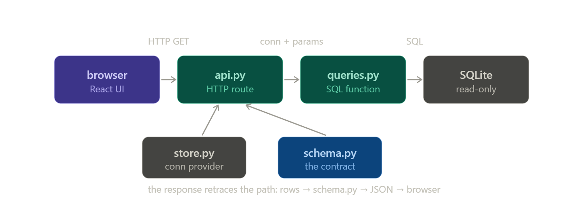

# Intro

Yes. Here’s the mental model you need first.

FastAPI is a Python program that **waits for HTTP requests** and returns data, usually JSON.

```text
Browser / React
      ↓ request
FastAPI endpoint
      ↓ calls Python logic
CSV / SQLite / forecast engine
      ↓
FastAPI returns JSON
      ↓
React displays it
```

## 1. What `uvicorn main:app --reload` means

Suppose you have:

```python
# main.py
from fastapi import FastAPI

app = FastAPI()

@app.get("/")
def home():
    return {"message": "GrowLytics API is running"}
```

When you run:

```bash
uvicorn main:app --reload
```

It means:

```text
main     → file name: main.py
app      → variable inside main.py: app = FastAPI()
--reload → restart automatically when code changes
```

Uvicorn is the actual web server program. FastAPI defines the API; Uvicorn hosts it and listens for requests. FastAPI’s docs describe Uvicorn as an ASGI server used to run FastAPI apps.

After running it, this exists:

```text
http://localhost:8000
```

Your computer is now listening on port `8000`.

## 2. What decorators are

This:

```python
@app.get("/warnings")
def get_warnings():
    return {"warning_count": 3}
```

means:

```text
When someone sends GET request to /warnings,
run get_warnings().
```

The decorator is the line:

```python
@app.get("/warnings")
```

FastAPI’s official tutorial calls this a “path operation decorator”: it connects a URL path and HTTP method to the function below it.

Without decorator:

```python
def get_warnings():
    return {"warning_count": 3}
```

This is just a normal Python function.

With decorator:

```python
@app.get("/warnings")
def get_warnings():
    return {"warning_count": 3}
```

Now it becomes an API endpoint.


## 4. The magic page

FastAPI automatically gives you API docs here:

```text
http://localhost:8000/docs
```

That page lets you test endpoints without React. This is huge for you because you can build the serving layer first.

## 5. Path parameters

Use these when part of the URL identifies something.

```python
@app.get("/clients/{client_id}/forecast")
def get_client_forecast(client_id: str):
    return {"client_id": client_id}
```

URL:

```text
http://localhost:8000/clients/c0001/forecast
```

Returns:

```json
{"client_id":"c0001"}
```

FastAPI receives `c0001` and passes it into:

```python
client_id
```

## 6. Query parameters

Use these for filters/options.

```python
@app.get("/warnings")
def get_warnings(client_id: str, year: int, threshold: float = 100000):
    return {
        "client_id": client_id,
        "year": year,
        "threshold": threshold,
    }
```

URL:

```text
http://localhost:8000/warnings?client_id=c0001&year=2026&threshold=150000
```

FastAPI automatically parses:

```python
client_id = "c0001"
year = 2026
threshold = 150000
```

This is perfect for GrowLytics.

```text
/warnings?client_id=c0001&year=2026&revision=post-seeding
```

## 7. How React talks to FastAPI

React will eventually do:

```javascript
const response = await fetch("http://localhost:8000/warnings/upcoming-expenses");
const data = await response.json();
```

That is just a browser sending an HTTP request to your backend.

But because React runs at:

```text
http://localhost:5173
```

and FastAPI runs at:

```text
http://localhost:8000
```

you need CORS.

Add this to FastAPI:

```python
from fastapi.middleware.cors import CORSMiddleware

app.add_middleware(
    CORSMiddleware,
    allow_origins=["http://localhost:5173"],
    allow_methods=["*"],
    allow_headers=["*"],
)
```

CORS basically says:

```text
I allow the frontend at localhost:5173 to call this backend at localhost:8000.
```

## 8. The GrowLytics serving layer pattern

Do not put everything in `main.py`.

Use this shape:

```text
backend/
  main.py
  services/
    warnings.py
    forecast.py
    lineage.py
  repositories/
    csv_repository.py
```

Example:

```python
# services/warnings.py

import pandas as pd


def generate_upcoming_expense_warnings(df: pd.DataFrame, threshold: float):
    warnings = (
        df[df["amount"] >= threshold]
        .sort_values("amount", ascending=False)
    )

    return warnings.to_dict(orient="records")
```

Then:

```python
# main.py

from pathlib import Path

import pandas as pd
from fastapi import FastAPI

from services.warnings import generate_upcoming_expense_warnings

app = FastAPI()
DATA_ROOT = Path(__file__).resolve().parents[1] / "data"


@app.get("/warnings/upcoming-expenses")
def get_upcoming_expenses(threshold: float = 100000):
    df = pd.read_csv(DATA_ROOT / "crop_input_streams.csv")
    return generate_upcoming_expense_warnings(df, threshold)
```

This keeps FastAPI thin.

FastAPI should mostly do:

```text
Receive request
Validate parameters
Call service logic
Return response
```

Your real intelligence stays in services.

## 9. Your first 5 endpoints

Build these before touching React seriously:

```text
GET /
GET /forecast/summary
GET /warnings/upcoming-expenses
GET /lineage/{output_key}
GET /revisions/compare?base=rev1&target=rev2
```

That gives you the skeleton of the platform.


# Linking FastAPI with SQLite

Yes — `api.py` is exactly where the FastAPI app lives and where the HTTP endpoints your frontend will call are defined. And `store.py` is the dedicated connection door you wanted, so nothing else in the codebase ever opens or closes the store. Let me give you the whole picture, then the three files, all tested against the store you already have.

Here's the complete request path through the real files you'll have after this step:



Let me build the files. First a one-line addition to `config.py` (the API needs to know which browser origins may call it):

Now let me install FastAPI and prove the whole stack works end to end with a test client hitting the real endpoints.

It all works end to end. Every endpoint returns the right JSON, `schema.py` coerced the integer sums into the declared `float` fields, the missing-`orchestration` case returns 404, and — note this — FastAPI returned a 422 with a precise error when the required `month` param was missing, *for free*, because the parameter is declared. That validation is one of the things you get by keeping the HTTP concerns in `api.py`. Let me hand you the files.Here's how the three files fit together and the mental model for each.

`store.py` is the door, and the two things to take from it are *read-only* and *one place*. The serving connection is opened in SQLite's `mode=ro`, which makes Invariant 3 physical rather than aspirational: if a query ever contained a stray write, it would error instead of corrupting your projection. The loader (`build_serving_store.py`) is the only thing that opens a read-write connection, so writer and reader literally use different doors. The compartmentalization you wanted means this file is also the *single* place that changes when you move to the cloud — `_open_readonly` becomes "get a connection from the Postgres pool," and nothing in `queries.py` or `api.py` is touched. It exposes the same lifecycle two ways: `connect()` (a context manager for scripts and your `queries.py` smoke test) and `get_conn()` (the same thing shaped as a FastAPI dependency). Both open one connection and guarantee it closes.

`schema.py` is the contract. Each model's fields match exactly what the corresponding `queries.py` function returns. FastAPI uses these to validate the response before it ships, serialize it to JSON, and — the nice payoff — auto-generate interactive docs. Your frontend's TypeScript types will mirror these models, so a shape change is felt deliberately on both sides instead of silently breaking the UI.

`api.py` is the only file that speaks HTTP, and every route is the same four steps: FastAPI validates the params, `Depends(store.get_conn)` injects a read-only connection, the route calls the matching `queries.py` function, and `response_model` shapes the JSON. That `Depends` is the dependency-injection pattern — you declare "this route needs a connection," and FastAPI calls `get_conn`, hands you the yielded connection, and runs the cleanup after the response is sent. Three things worth internalizing: the routes are sync `def` (not `async`) because `sqlite3` blocks and sync routes run in a threadpool so a slow query can't stall the server; the URL design mirrors your drill path (`/monthly` → `/sources?month=` → `/lineage?month=&source=`); and I left a visible authorization seam in the comments where the `client_id` check belongs — there's no auth yet, so that's the one real gap to close before this is exposed to real clients.

To run the whole thing locally:

```bash
python build/build_serving_store.py        # build time: load the store (once per revision)
uvicorn api:app --reload                    # run time: start the serving layer
```

Then open `http://localhost:8000/docs` — FastAPI builds a live, clickable documentation page from `schema.py` where you can try every endpoint in the browser. That page *is* your query surface made visible, and it's the thing you'll hand a frontend developer (or yourself) to see exactly what the UI can call.

From the frontend, each interaction is one `fetch` to one of these URLs — pick a client from `/clients`, a revision from `/orchestrations`, draw the chart from `/monthly`, and the two drill clicks hit `/sources` and `/lineage`. That's the entire contract the React app depends on.

You now have a complete, tested local serving layer: loader → store → queries → connection door → API. The natural next steps are `tests/test_queries.py` to lock the query shapes (the blueprint's smoke test, formalized), closing the authorization seam, or starting the frontend `apiClient.ts` against these endpoints. Want me to take the tests next, since they protect everything you've built so far?


# Code Appendix

## `store.py`

```py
"""
store.py — the one door to the serving store.

COMPARTMENTALIZATION
    Nobody else opens or closes a connection. Routes, scripts, and the smoke
    test ask store.py for a connection and hand it to queries.py. Because every
    connection is created here, this is the SINGLE file you reimplement when the
    backend moves from a local SQLite file to a managed cloud database
    (Invariant 9). queries.py and api.py do not change.

READ-ONLY BY DESIGN
    The serving path must never write (Invariant 3). The connection handed out
    here is opened in SQLite's read-only mode, so a stray INSERT/UPDATE inside a
    query fails loudly instead of corrupting the projection. The ONLY writer is
    build/build_serving_store.py, which opens its own separate read-write
    connection. Reader and writer never share a door.

ONE CONNECTION PER UNIT OF WORK
    Each request (or script block) gets its own connection and closes it when
    done (Invariant 10). Connections are never held as shared global state, which
    is what keeps the serving layer stateless and safe to run as many instances.

TWO ENTRY POINTS, SAME LIFECYCLE
    connect()   — a context manager for scripts and tests.
    get_conn()  — the same thing packaged as a FastAPI dependency.
"""

from __future__ import annotations

import sqlite3
from collections.abc import Iterator
from contextlib import contextmanager

import config


def _open_readonly() -> sqlite3.Connection:
    """Open the store read-only. Raises if the store file does not exist yet
    (i.e. the loader has not been run)."""
    if not config.STORE_PATH.exists():
        raise FileNotFoundError(
            f"Store not found at {config.STORE_PATH}. "
            f"Run `python build/build_serving_store.py` first."
        )
    # The URI form lets us request read-only mode explicitly.
    conn = sqlite3.connect(f"file:{config.STORE_PATH}?mode=ro", uri=True)
    # Rows come back as mapping-friendly objects if used directly; queries.py
    # does not rely on this, but it is good hygiene.
    conn.row_factory = sqlite3.Row
    return conn


@contextmanager
def connect() -> Iterator[sqlite3.Connection]:
    """For scripts and the queries.py smoke test:

        with store.connect() as conn:
            rows = queries.level0_monthly(conn, orch)

    Opens one read-only connection and guarantees it is closed.
    """
    conn = _open_readonly()
    try:
        yield conn
    finally:
        conn.close()


def get_conn() -> Iterator[sqlite3.Connection]:
    """FastAPI dependency. FastAPI calls this once per request, injects the
    yielded connection into the route, then runs the cleanup after the response
    is sent:

        @app.get(...)
        def route(conn: sqlite3.Connection = Depends(store.get_conn)):
            ...

    It simply delegates to connect(), so both entry points share one lifecycle.
    """
    with connect() as conn:
        yield conn

```

## `schema.py`

```py
"""
schema.py — the response contracts (Invariant 6).

One source of truth for the SHAPE of every response. Each model's fields match,
exactly, the keys a queries.py function returns. FastAPI uses these to:
  * validate that a response really has the promised shape before it ships,
  * serialize rows to JSON,
  * auto-generate the interactive API docs at /docs.

The frontend's TypeScript types (types.ts) will mirror these models. Changing a
shape here is a deliberate, versioned contract change felt on both sides.
"""

from __future__ import annotations

from pydantic import BaseModel


class Client(BaseModel):
    client_id: str
    client_name: str


class Orchestration(BaseModel):
    orchestration_key: str
    revision_name: str
    client_id: str
    client_name: str


class MonthlyPoint(BaseModel):
    month: str
    month_num: int
    inflow: float
    outflow: float
    net: float


class SourceAmount(BaseModel):
    source: str
    amount: float


class LineageRow(BaseModel):
    output_key: str
    output_name: str
    input_output_key: str
    crop_sys: str
    revision_name: str
    stream_value: float
    perc: float
    allocated_value: float

```

## `api.py`

```py
"""
api.py — the FastAPI serving layer. The ONLY file that speaks HTTP.

WHERE IT SITS
    This is the run-time entry point. You start it with:
        uvicorn api:app --reload
    It is a long-running process that wakes on each HTTP request, and it only
    ever READS the store (Invariant 3). It contains no SQL and no rendering.

WHAT EACH ROUTE DOES (always the same four steps)
    1. FastAPI parses + validates the path/query parameters (types, required-ness).
    2. store.get_conn (injected via Depends) hands the route a read-only conn.
    3. The route calls the matching queries.py function with that conn + params.
    4. The route returns the rows; `response_model` (schema.py) validates and
       serializes them to JSON.
    The route is deliberately thin — all real work lives in queries.py.

SYNC `def`, NOT `async def`
    sqlite3 is blocking. A plain `def` route runs in FastAPI's threadpool, so a
    slow query never blocks the event loop. Using `async def` with a blocking
    sqlite call would stall the whole server — so these stay sync.

URL DESIGN MIRRORS THE DRILL PATH
    /clients                                  -> the client picker
    /orchestrations?client_id=...             -> the revision picker
    /forecast/{orchestration_key}/monthly     -> LEVEL 0 (the chart)
    /forecast/{orchestration_key}/sources     -> LEVEL 1 (click a month)
    /forecast/{orchestration_key}/lineage     -> LEVEL 2 (click a source)
"""

from __future__ import annotations

import sqlite3

from fastapi import Depends, FastAPI, HTTPException, Query
from fastapi.middleware.cors import CORSMiddleware

import config
import queries
import schema
import store

app = FastAPI(title="GrowLytics Serving Layer", version="0.1.0")

# A browser on the frontend's origin must be granted permission to call this
# API; without this the browser blocks the requests. Origins come from config.
app.add_middleware(
    CORSMiddleware,
    allow_origins=config.CORS_ORIGINS,
    allow_methods=["GET"],
    allow_headers=["*"],
)


# --------------------------------------------------------------------------- #
# Control panels
# --------------------------------------------------------------------------- #
@app.get("/clients", response_model=list[schema.Client])
def get_clients(conn: sqlite3.Connection = Depends(store.get_conn)):
    return queries.list_clients(conn)


@app.get("/orchestrations", response_model=list[schema.Orchestration])
def get_orchestrations(
    client_id: str | None = Query(default=None, description="optional: scope to one client"),
    conn: sqlite3.Connection = Depends(store.get_conn),
):
    return queries.list_orchestrations(conn, client_id)


# --------------------------------------------------------------------------- #
# The drill-down
# --------------------------------------------------------------------------- #
@app.get("/forecast/{orchestration_key}/monthly", response_model=list[schema.MonthlyPoint])
def get_monthly(
    orchestration_key: str,
    conn: sqlite3.Connection = Depends(store.get_conn),
):
    # NOTE (authorization seam): there is no auth yet, so any caller can read any
    # orchestration. This is where you would check that the authenticated user is
    # allowed to see this orchestration_key's client before querying — the fix
    # for the "swap c0001 -> c0002" risk in the OWASP notes.
    rows = queries.level0_monthly(conn, orchestration_key)
    if not rows:
        raise HTTPException(status_code=404, detail=f"No data for {orchestration_key!r}")
    return rows


@app.get("/forecast/{orchestration_key}/sources", response_model=list[schema.SourceAmount])
def get_sources(
    orchestration_key: str,
    month: str = Query(..., description="e.g. 2026-03"),
    conn: sqlite3.Connection = Depends(store.get_conn),
):
    return queries.level1_sources(conn, orchestration_key, month)


@app.get("/forecast/{orchestration_key}/lineage", response_model=list[schema.LineageRow])
def get_lineage(
    orchestration_key: str,
    month: str = Query(..., description="e.g. 2026-03"),
    source: str = Query(..., description="e.g. fertilizer"),
    conn: sqlite3.Connection = Depends(store.get_conn),
):
    return queries.level2_lineage(conn, orchestration_key, month, source)


# --------------------------------------------------------------------------- #
# Liveness probe (handy for deploys / load balancers)
# --------------------------------------------------------------------------- #
@app.get("/health")
def health():
    return {"status": "ok"}

```