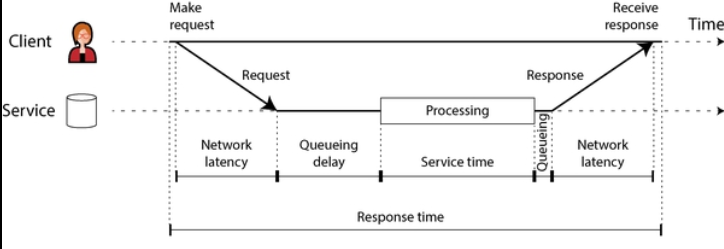

# Defining Nonfunctional Requirements

Functional vs. Nonfunctional Requirements
- functional requirements — functionality that the application must offer
  - what screens and what buttons you need
  - what each operation is supposed to do in order to fulfill the purpose of your software
- nonfunctional requirements
  - e.g., the app should be fast, reliable, secure, legally compliant, and easy to maintain
  - specifically, this chapter covers
    - defining and measuring the **performance** of the a system
    - **reliability** — continuing to work correctly, even when things go wrong
    - **scalability** — efficient ways of adding computing capacity
    - easier to **maintain**

## Case Study: Social Network (e.g., Twitter) — Home Timelines

- Assumptions
  - users make a total of 500 million posts per day, or 5,800 posts per second on average
    - the rate can spike to as high as 150,000 posts per second occasionally
  - average user follows 200 people and has 200 followers

---
### Representing Users, Posts, and Follows

Keep all data in a relational database as follows:
- follower table
    |follower_id|followee_id|
    |---|---|
    |1705506|12|
- post table
    |id|sender_id|text|timestamp|
    |---|---|---|---|
    |20|12|just setting up my twttr|1142974214|
- user table
    |id|screen_name|profile_image|
    |---|---|---|
    |12|jack|1234567.jpg|

Assume
  - main read operation must be supported is **home timeline**
    - displays recent posts by people the user is following

SQL query

```sql
SELECT posts.*, users.*
    FROM follower
    JOIN post ON follower.followee_id = post.sender_id
    JOIN user ON post.sender_id = user.id
    WHERE user = current_user
    ORDER BY post.timestamp DESC
    LIMIT 1000
```

Objective — after somebody makes a post, want followers to be able to see it within five seconds
- ***polling*** — user's client repeat the query every five seconds while the user is online
  - if assume 10 million users are online
    - running the query 2 million times per second, this is a lot
  - query also needs to fetch a list of recent posts by each of those 200 people the user is following and merge those lists
    - 2 million timeline queries per second times 200 followed accounts makes **400 million** lookups per second

---
### Materializing and Updating Timelines

Polling is expensive, how can we do better?
- first, server could actively push new posts to any followers who are online
- second, precompute the results of the query so user's request for their home timeline can be served from a cache

**materialization** — speeds up reads, but in turn do more work on writes
- timeline cache is an example of a **materialized view**
  - mechanics
    - store a data structure containing user's home timeline (the recent posts by people they follow)
    - everytime a user makes a post, look up all their followers and insert that post into the home timeline of each follower
    - now precomputed home timeline can be served directly
  - downside
    - more work every time a user makes a post, home timelines are derived data that needs to be updated
      - when one initial request results in several downstream requests being carried out, **fan-out** is used to describe the factor by which the number of requests increases
    - comparative load
      - at a rate of 5,800 posts per second, with fan-out factor of 200 (200 followers)
      - just over 1 million home timline writes per second
      - better than 400 million per-sender post lookups per second
    - spikes
      - enqueue them and accept that it will temporarily take a bit longer for posts to show up in followers' timelines
      - but timelines remain fast to load, since simply served from a cache
- extreme cases
  - a user following a very large number of accounts, and those accounts post a lot
    - user has high rate of writes to their materialized timeline
    - user not likely to read all the posts → drop some of their timeline writes
    - show only a sample of the posts from those accounts
  - a celebrity account with a very large number of followers makes a post
    - insert post to millions of followers → dropping some writes is not OK
    - store celebrity posts separately and merging them with the materialized timeline when it is read
    - handling celebrities on a social network can require a lot of infrastructure

## Performance

Two main types of metric
- **response time**
  - the elapsed time from the moment when a user makes a request until they receive the requested answer
- **throughput**
  - the number of requests per second, or the data volume per second, that the system is processing
- relationship
  - service has low response time when request throughput is low
  - response time increases as load increases
  - because of **queueing**
    - request arrives on a highly loaded system → CPU is likely already in the process of handling an earlier request → incoming request needs to wait
    - as throughput approaches the maximum that the hardware can handle, queueing delays increase sharply (nonlinearly)

Side note — when an overloaded system won't recover
- **retry storm**
  - a long queue of requests is waiting to be handled
  - response times increase so much that clients time out and resent their request
  - causes the rate of requests to increase even further
  - making the problem worse — a **retry storm**
- **metastable failure**
  - even when the load is reduced again
  - such a system may remain in an overloaded state until it is rebooted or otherwise reset
  - it can cause serious outages in production systems
- solutions
  - **exponential backoff** — increase and randomize the time between successive retries on the client side
  - **circuit breaker** — temporarily stop sending requests to a service that has returned errors or timed out recently
  - **load shedding** — server detect when it is approaching overload and start proactively rejecting requests
  - **backpressure** — send back responses asking clients to slow down

---
### Latency and Response Time

Terminologies
- **response time**
  - what the client sees
  - includes all delays incurred anywhere in the system
- **service time**
  - duration for which the service is actively processing the client's request
- **queueing delays** — occurs at several points
  - after a request is received, need to wait until CPU is available
  - response packet need to be buffered before it is sent over the network if other tasks on the same machine are sending a lot of data via the outbound network
- **latency**
  - catchall term for time during which a request is not being actively processed
  - in particular, **network latency** or **network delay** refers to the time that a request and response spend travelling through the network

**Example flow**  


Response time can vary significantly
- even the same request is sent over and over again
- factors that add random delays
  - a context switch to a background process
  - loss of a network packet and TCP retransmission
  - a garbage collection pause
  - a page fault forcing a read from disk
  - a mechanical vibrations in the server rack
- **queueing delays** often account for a **large part** of the variability in response times
  - **head-of-line blocking** — it takes only a small number of slow requests to hold up the processing of subsequent requests