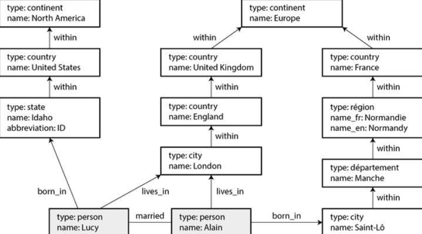

# Data Models and Query Languages

Data Models
- effect
  - how the software is written
  - how we **think about the problem** that we are solving
- software as layered data models
  - example
    - L1 — **model** the real world in terms of objects or data structures and APIs that manipulate data structures
      - e.g., money flows, sensors, ...
    - L2 — need to **store** those data structures, express them in terms of a general-purpose data model
      - such as JSON, XML documents, tables in a relational database, or vertices and edges in a graph
    - L3 — database software that decides a way of **representing** that document, relational, or graph **data** in terms of **bytes** in memory, on disk, or on a network
      - allow the data to be queried, searched, manipulated, and processed in various ways
    - L4 — hardware engineers the figure out how to **represent bytes** in terms of electrical current, pulses of light, magnetic fields, and more
  - complex application can have many more intermediary levels, but with the same **basic idea**
    - each layer hides the complexity of the layers below it by providing a clean data model
- data models
  - relational model, document model, graph-based data models, event sourcing, and DataFrames
  - some types of data and some queries are easy to express in one model and awkward in another

**Declarative Query Languages**
- many query languages are declarative
  - specify the pattern of the data you want
    - what conditions the results must meet 
    - how you want the data to be transformed (e.g., sorted, grouped, and aggregated)
    - but not **how** you achieve that goal
- in contrast, with most programming languages, you would have to write an algorithm telling the computer which operations to perform in which order

## Relational vs. Document Models

Brief evolution
- best-kown data model is **SQL**
  - data is organized into **relations** (called tables in SQL), where each realtion is an unordered collection of **tuples** (rows in SQL)
- each subsequent competitor to the relational model generated a lot of hype in its time, but none lasted
  - instead, SQL has grown to incorporate other types of data
  - e.g., adding support for XML, JSON, and graph data
- **NoSQL**
  - a single technology
    - a loose set of ideas around new data models, schema flexibility, scalability, and a move toward open source licensing models
  - one lasting effect of NoSQL is the popularity of the **document model**, which usually represents data as **JSON**
    - originally popularized by specialized document databases such as MongoDB and Couchbase
    - although most relational databases have now also added JSON support

---
### The Object-Relational Mismatch

Criticism of SQL data model
- much application development is done in **object-oriented programming languages**
- there must be an awkward translation layer between the objects in the application code and the database model of tables, rows, and columns

Object-relational mapping (**ORM**)
- frameworks that reduce the amount of biolerplate code required for the awkward transition layer
- common cited problems
  - ORMs are complex and can't completely hide the differences between the two models
  - generally used for **OLTP** app development
    - for analytics purposes, the design of the relational schema still matters when using an ORM
  - many work only with relational OLTP databases
    - systems like search engines, graph databases, and NoSQL systems might find ORM **support lacking**
  - make it easy to accidentally write inefficient queries
- advantages
  - for data well suited to a relational model
    - some kind of translation between the persistent relational and in-memory object representation is inevitable
    - ORM reduce the amount of boilerplate code required for this translation
  - some help with caching the results of database queries, which can help reduce the load on the database
  - help with managing schema migrations and other administrative activities

---
### Document data model for one-to-many relationships

Motivation
- not all data lends itself well to a relational representation
  - e.g., consider a LinkedIn profile
    - `first_name`, `last_name` appear exactly once per user, so they can be modeled as columns on the user table
    - but most people have had more than one job in their career, and people may have varying numbers of periods of education

Two approaches to represent one-to-many relationship
- one way is to put positions, education, and contact information in separate tables, each with a foreign-key reference to the `users` table
- another way is as a JSON document
  - it is perhaps more natural and more closely object structure in application code

Benefits of JSON representation
- locality
  - fetching a profile in relational example involves 
    - performing multiple queries (each table by `user_id`)
    - performing a messy multiway join between the users table and its subordinate tables
  - JSON representation have all relevant information in one place, making the query both faster and simpler
- representation of tree structure
  - one-to-many relationships from the user profile to the user's positions, education history, and contact info imply a tree structure 
  - JSON representation makes this tree structure explicit
  - **example** tree structure  
    

---
### Normalization, Denormalization, and Joins

ID vs. Text String
- for example, `region_id` vs. `Washington, DC, United States`
- advantages to have standardized list of geographic regions and let users choose from a drop-down list or autocomplete
  - consistent style and spelling
  - avoid ambiguity if several places have the same name
    - if the string were just Washington, DC, would it refer to DC or to the state?
  - ease of updating — the name is stored in only one place, it is easy to update across the board
  - localication support — when the site is translated into other languages, the standardized lists can be localized
    - so the region can be displayed in the viewer's language
  - better search functionality
    - a search for pepole on the US East Coast can match this profile, because the list of regions can encode the fact that Washington is located on the East Cost

Normalization
- whether to store an ID or a text string is a question of **normalization**
  - using an ID is more normalized: the information that is meaningful to humans is stored in only one place, and everything that refers to it uses an ID
  - when storing text directly, you are duplicating the human-meaningful information in every record that uses it
    - this representation is **denormalized**
- advantage of using an ID
  - it never needs to change
    - the ID can remain the same even if the information it identifies changes
    - anything meaningful to humans may need to change sometime in the future — and if the information is duplicated, all the redundant copies will need to be updated
- downside of normalized representation
  - every time you want to display a record containing an ID, you have to do an additional lookup to resolve the ID into something human-readable
  - i.e., **join**s
- **document databases** can store both normalized and denormalized data
  - but they are often **associated with denormalization** 
    - partly because the JSON data model makes it easy to store additional denormalized fields
    - partly because the weak support for joins in many document databases makes normalization inconvenient

Trade-offs of normalization
- motivation
  - in the LinkedIn profile example
    - `region_id` field is a reference to a standardized set of regions
    - `organizations` and `school_name` are just strings
      - these are denormalized: many people may have worked at the same company, but there is no ID linking them
  - it is worth considering whether the organization and school name should be entities instead, and the profile should reference their IDs
    - the same arguments for referencing the ID of a region also apply here
- **general principle**
  - normalized data is
    - faster to write (since there is only one copy)
    - slower to query (since it requires joins)
  - denormalized data is usually
    - faster to read (fewer joins)
    - more expensive to write (more copies to update, more disk space used)
  - additional consideration
    - need to consider the consistency of the database if a process crashes halfway through making its updates
- normalization form vs. type of system
  - normalization tends to be better for **OLTP** systems
    - where both reads and updates need to be fast
  - **analytical system** often fare better with denormalized data
    - since they perform updates in bulk
    - and the performance of read-only queries is the dominant concern
  - **small to moderate scale**
    - a normalized data model is often best because 
      - you don't have to worry about keeping multiple copies of the data consistent with one another
      - cost of performing joins is acceptable
  - **very large-scale systems**
    - cost of joins can become problematic

---
### Denormalization in the social networking case study

Normalized representation vs. denormalized one
- compare the two approaches to assemble the post timeline
  - original joins between posts and follows were too expensive, and the materialized timeline is a cache of the result of the joins
  - fan-out process that inserts a new post into followers' timelines was our way of keeping the denormalized representation consistent
- actual implementation
  - in the fan-out method, Twitter does not store the actual text of each post
  - each entry stores only 
    - the post ID
    - the ID of the user who posted it
    - a little bit of extra information to identify reposts and replies
  - this means
  - whenever the timeline is read, the service still needs to perform two joins
    - it looks up the post ID to fetch the actal post content (as well as statistics such as the number of likes and replies)
    - it looks up the sender's profile by ID (to get their username, profile picture, and other details)
- **hydrating** — the process of looking up the human-readable information by ID

Architectural choice
- reason for storing only IDs in the precomputed timeline is that the data they refer to is fast-changing
  - number of likes and replies may change multiple times per second on a popular post
  - some users regularly change their username or profile photo
- denormalizing this information into the materialized timeline would not make sense
  - since the timeline should show the latest like count and profile picture when it is viewed
  - and storage cost would be increased significantly by such denormalization
- hydrating post and user IDs is actually a fairly easy **operation to scale**
  - since it parallelizes well
  - and the cost doesn't depend on the number of accounts you are following or the number of followers you have

---
### Many-to-One and Many-to-Many Relationships

In the profile example
- **positions** and **education** tables are examples of **one-to-many** relationship
  - i.e., one resume has several positions, but each position belongs only to one resume
- `region_id` field is an example of **many-to-one** relationship
  - i.e., many people live in the same region, but we assume that each person lives in only one region at any one time
- `organizations` is an example of `many-to-many` relationships
  - i.e., one person may have worked for several organizations, and an organization has several past or present employee

Data structure and querying
- many-to-one and many-to-many relationships do not easily fit within one self-contained JSON document, they lend themselves more to a **normalized** representation
- many-to-many relationships often need to be queried in **both directions**
  - e.g., finding all the organizations that a particular person has worked for, and finding all the people who have worked at a particular organization
  - one way of enabling such queries is to store ID references on both sides
    - such that 
      - a resume includes the ID of each organization where the person has worked
      - the organization document includes the IDs of the resumes that mention that organization
    - this presentation is **denormalized**, since the relationship is stored in two places, which could become inconsistent with each other
- a normalized representation stores the relationship in only one place and relies on **secondary indexes**
  - allow the relationship to be efficiently queried in both directions

---
### Stars and Snowflakes: Schemas for Analytics

Widely used conventions for structure of tables in a data warehouse
- star schema
- snowflake schema
- dimensional modeling
- one big table (OBT)

Star schema
- structure
  - at the center of the schema is **fact table**
    - each row of the fact table represents an event that occurred at a particular time
      - it allows maximum flexibility of analysis later
      - but it can become extremely large
  - some columns in the fact table are **attributes**, such as the price at which the product was sold and the cost of buying it from the supplier
  - other columns in the fact table are foreign-key references to other tables, called **dimension tables**
    - dimensions represent the *who, what, where, when, how,* and *why* of the event
    - queries often involve multiple joins to multiple dimension tables
    - even date and time are often represented using dimension tables
      - allows additional information about dates (e.g., public holiday) to be encoded
      - enabling queries to differentiate between sales on holidays and non-holidays

Snowflake schema
- when dimensions of star schema are further broken into subdimensions
  - e.g., there could be separate tables for brands and product categories, 
  - and each row in the `dim_product` table could reference the brand and category as foreign keys, rather than strings in the `dim_product` table
- is more normalized than star schema, but star schemas are often preferred because they are simpler for analysts to work with

One big table (OBT)
- motivation
  - star or snowflake schema consists mostly of many-to-one relationships
    - e.g., many sales occur for one particular product, in one particular store
  - in principle, other relationship types could exist, but they are often denormalized to simplify queries
    - e.g., if a customer buys several different products at once, that multi-item transaction is not represented explicitly
    - instead, the fact table has a separate row for each product purchased, and those facts all just happen to have the same customer ID, store ID, and timestamp
- some data warehouse schemas take denormalization even further and leave out the dimension tables entirely
  - folding the information in the dimensions into denormalized columns in the fact table instead
  - essentially, precomputing the join between the fact table and the dimension tables
  - this approach is known as **one big table** (OBT)
- trade-off
  - it requres more storage space, it sometimes enables faster queries
  - in **analytics**, denormalization is unproblematic, since the data typically represents a log of historical data that is not going to change
  - the issue of consistency and write overheads that occur with denormalization in **OLTP** systems are not as pressing in analytics

---
### When to Use Which Model

Quick Overview
- document data model
  - schema flexibility
  - better performance due to locality
  - closer to the object model for some applications
- relational model
  - better support for joins and many-to-one and many-to-many relationships

Document model
- preferred when data in the application has a document-like structure
  - i.e., a try of one-to-many relationships
  - where typically the entire tree is loaded at once
- relational technique of **shredding** can lead to cumbersome schemas and unnecessarily complicated application code
  - shredding: splitting a document-like structure into multiple tables
- limitations
  - cannot refer directly to a nested item within a document
    - instead, you need to say something like, "the second item in the list of positions for user 251"
    - if you need to reference nested items, a relational approach works better, since you can refer to any item directly by its ID
- additional advantage
  - some applications allow the user to choose the order of items (e.g., to-do list)
  - document model supports such application well
    - because the items (or their IDs) can simply be stored in a JSON array to determine their order
  - in relational databases, there isn't a standard way of representing such reorderable lists various tricks are used, such as 
    - sorting by an integer column (requiring renumbering when you insert into the middle)
    - maintaining a linked list of IDs
    - using fractional indexing


---
### Schema flexibility in the document model

shcema-on-read vs. schema-on-write
- motivation
  - most document databases, and the JSON support in relational databases, do not enforce any schema on the data in documents
  - no schema means that
    - arbitrary keys and values can be added to a document
    - when reading, clients have no guarantees as to what fields the documents may contain
- **schema-on-read**
  - the structure of the data is implicit and interpreted only when the data is read
  - code that reads the data from document databases usually assumes some kind of structure
    - that is, there is an **implicit schema**, but it is not enforced by the database
- **schema-on-write**
  - the traditional approach of relational databases
  - the schema is explicit and the database ensures that all data conforms to it when the data is written

Difference between approaches
- the difference is particularly noticeable when an application wants to change the format of its data
- e.g., before: storing each uer's full name in one field; after: store the first name and last name separately
  - document database
    - just start writing new documents with the new fields and have code in the application that handles the case when old documents are read, for example
        ```java
        if (user && user.name && !user.first_name) {
          // documents written before Dec 8, 2023 don't have first_name
          user.first_name = user.name.split(" ")[0];
        }
        ```
    - **downside**
      - every part of application that reads from the database now needs to deal with documents in old formats
  - relational databases
    - would typically perform a **migration** along the lines of
        ```sql
        ALTER TABLE users ADD COLUMN first_name text DEFAULT NULL;
        UPDATE users SET first_name = split_part(name, '', 1);  --PostgreSQL
        UPDATE users SET first_name = substring_index(name, '', 1); --MySQL
        ```
    - adding a column with a default value is fast and unproblematic, even on large tables
    - running the UPDATE statement is likely to be slow on a large table
      - since every row needs to be rewritten
      - and other schema operations (such as changing the datatype of a column) also typically require the entire table to be copied

---
### Data locality for reads and writes

Trade-offs
- fact: a document is usually stored as a single continuous string, encoded as JSON, XML, or a binary variant (e.g., MongoDB's BSON)
- **locality advantageous** if application often needs to **access the entire document** (e.g., to render it on a web page)
  - if data is **split across multiple tables** 
    - multiple index lookups are required to retrieve it all
    - may require more disk seeks and take more time
  - locality advantage only applies if large parts of the document are needed at the same time
    - i.e., database needs to load the entire document
    - wasteful if only need to access a small part of a large document
- **downside**: on **updates** to a document, the entire document usually needs to be rewritten
  - it is generally recommended that you keep documents fairly small and avoid frequent small updates

Storing related data together for locality outside of document model
- Google's Spanner database offers the same locality properties in a relational data model
  - by allowing the schema to declare that a table's rows should be interleaved (nested) within a parent table
- Oracle allows the same thing, using a feature called **multi-table index cluster tables**
- **wide-column** data model popularized by Google's Bigtable and used, for example, in HBase and Accumulo has **column families**
  - which have a similar purpose of managing locality


---
### Query languages for documents

Most relational databases are queried using **SQL**, but document databases are more varied
- some only allow key-value access by primary key
- others also offer secondary indexes to query for values inside documents
- some provides rich query language

Examples of query languages
- XML databases are often queried using XQuery and XPath
  - allows complex queries, including joins across multiple documents, and format results as XML
- JSON Pointer and JSONPath provide an equivalent XPath for JSON
- MongoDB's aggregation pipeline is an example of a query language for collections of JSON documents

Example of query
- scenario
  - marine biologist adds an observation record to database every time sees animals in the ocean
  - now wants to generate a report saying **how many sharks that have been sighted per month**
- PostgreSQL
    ```SQL
    SELECT date_trunc('month', observation_timestamp) AS observation_month,
      sum(num_animals) AS total_animals
    FROM observations
    WHERE family = 'Sharks'
    GROUP BY observation_month;
    ```
- MongoDB's aggregation pipeline
    ```js
    db.observations.aggregate([
      {$match: {family:"Sharks"}},
      {$group: {
        _id: {
          year: {$year: "$observationTimestamp"},
          month: {$month: "$observationTimestamp"}
        },
        totalAnimals: {$sum: "numAnimals"}
      }}
    ]);
    ```

---
### Convergence of document and relational databases

Document databases and relational databases started out as very different approaches to data management, but they have grown more similar over time
- **relational databases** 
  - added support for JSON types and query operators, 
  - and the ability to index properties inside documents
- some **document databases** 
  - added support for joins, secondary indexes, and declarative query languages
- relational-document hybrids are a powerful combination
  - many document databases need relational-style references to other documents
  - many relational databases have sections where schema flexibility is beneficial


## Graph-Like Data Models

Motivation
- **type of relationship** is an important distinguishing feature across data models
  - **document model** is appropriate if 
    - the application has mostly **one-to-many** relationships 
    - and few other relationships between records
  - **many-to-many**
    - **relational model** can handle simple cases of those relationships
    - but as the connections within data become more complex, it becomes more natural to start modeling that data **as a graph**

Graph
- consists of two kinds of objects
  - **vertices** (also known as nodes or entities)
  - **edges** (also known as relationships or arcs)
- data model examples
  - social graphs
    - vertices are people, and edges indicate which people know each other
  - the web graph
    - vertices are web pages, and edges indicate HTML links to other pages
  - road and rail networks
    - vertices are junctions, and edges represent the roads or railway lines between them
- examples of algorithms that can operate on these graphs
  - map navigation apps search for the shortest path between two points in a road network
  - PageRank can be used on the web graph to determine the popularity of a web page and thus its ranking in search results
- representations
  - **adjacency list** model
    - each vertex stores the IDs of its neighbor vertices that are one edge away
  - **adjacency matrix** model
    - a 2D array in which each row and column corresponds to a vertex
    - where the value is 0 when there is no edge between the row vertex and the column vertex and 1 when there is an edge
- a powerful use of graphs is to **provide a consistent way of storing completely different types of objects in a single database**
  - Facebook maintains a single graph with many types of vertices and edges
    - vertices represent
      - people
      - locations
      - events
      - check-ins
      - comments made by users
    - edges indicate
      - which people are friends with each other
      - which check-in happened in which location
      - who commented on which post
      - who attended which event
  - search engines use knowledge graphs to record facts about entities that often occur in search queries, such as organizations, people, and places
    - this information is obtained by crawling and analyzing the text on websites
    - some websites, such as Wikidata, also publish graph data in a structured form

Structuring and querying data
- data models
  - **property graph model**
  - **triple store model**
- query languages for graphs
  - **Cypher**
  - **SPARQL**
  - **Datalog**
  - **GraphQL**
  - plus SQL support for querying graphs

Example used
- two people are married and living in London
  - each persona nd each location is represented as a vertex
  - relationships between them are represented as edges





---
### Property Graphs

Characteristics
- each vertex consists of the following
  - a unique identifier
  - a label (string) to describe the type of object this vertex represents
  - a set of outgoing edges
  - a set of incoming edges
  - a collection of properties (key-value pairs)
- each edge consists of the following
  - a unique identifier
  - the vertex at which the edge starts (the *tail vertex*)
  - the vertex at which the edge ends (the *head vertex*)
  - a label to describe the kind of relationship between the two vertices
  - a collection of properties (key-value pairs)

Representation of property graph as a relational schema
- a graph store can be thought of as consisting of **two relational tables**, one for **vertices** and one for **edges**
  - the head and tail vertices are stored for each edge
  - if you want the set of incoming or outgoing edges for a vertex, you can query the edges table by `head_vertex` or `tail_vertex`, respectively
- example code  
  ```sql
  CREATE TABLE vertices (
    vertex_id integer PRIMARY KEY,
    label text,
    properties jsonb
  );
  CREATE TABLE edges (
    edge_id integer PRIMARY KEY,
    tail_vertex integer REFERENCES vertices(vertex_id),
    head_vertex integer REFERENCES vertices(vertex_id),
    label text,
    properties jsonb
  )
  CREATE INDEX edges_tails ON edges(tail_vertex);
  CREATE INDEX edges_heads ON edges(head_vertex);
  ```
- important aspects
  - any vertex can have an edge connecting it with any other vertex
    - there is no schema that restricts which kinds of things can or cannot be associated
  - given any vertex, you can efficiently find both its incoming and outgoing edges and thus **traverse** the graph both forward and backward
  - by using different labels for different kinds of vertices and relationships, you can store several kinds of information in a single graph, while still maintaining a clean data model
- the **edge table** is like the **many-to-many** associative, generalized to allow many types of relationship to be stored in the same table
- there may also be indexes on the labels and the properties, allowing vertices or edges with certain properties to be found efficiently

Difficulty to express in **traditional relational schema** such as
- different kinds of regional structures in different countries
  - e.g., France has `departments` and `regions`, whereas the US has `counties` and `states`
- quirks of history such as a country within a country
- varying granularity of data
  - e.g., Lucy's current residence is specified as a city, whereas her place of birth is specified at only the level of a state

Extending the graph to include many other facts, for example
- indicate any food allergies they have
  - by introducing a vertex for each allergen, and an edge between a person and an allergen to indicate an allergy
- link the allergens with a set of vertices that show which foods contain which substances
  - then you could write a query to find out what is safe for each person to eat
- graphs are good for **evolvability**
  - as you add features to your application, a graph can easily be extended to accommodate changes in the application's data structure


---
### The Cypher Query Language — for Property Graphs

Example to **create**
- insert the lefthand portion of the example into a graph database
- structure
  - each **vertex** is given a **symbolic name**, like usa or idaho
    - that **name is not stored** in that database but used only internally within the query to create edges between the vertices
  - edges are created using an **arrow notation** 
    - `(tail_node) -[:LABEL]-> (head_node)`

```js
(namerica   :Location   {name: 'North America',   type: 'continent'}),
(usa        :Location   {name: 'United States',   type: 'country'}),
(idaho      :Location   {name: 'Idaho',           type: 'state'}),
(lucy       :Person     {name: 'Lucy'}),
(idaho) -[:WITHIN]-> (usa) -[:WITHIN]-> (namerica),
(lucy) -[:BORN_IN]-> (idaho)
```

Example to **query**
- to find people who emigrated from the US to Europe  
```js
MATCH
(person) -[:BRON_IN]-> () -[:WITHIN*0..]-> (:Location {name: 'United States'}),
(person) -[:LIVES_IN]-> () -[:WITHIN*0..]-> (:Location {name: 'Europe'})
RETURN person.name
```
- the query can be read as follows
  - find any vertex (call it person) that meets both of the following conditions
    - person has an outgoing `BORN_IN` edge to a vertex
      - from that vertex, you can follow a chain of outgoing `WITHIN` edges 
      - until eventually you reach a vertex of type `Location`, whose name property is equal to `United States`
    - that same person vertex also has an outgoing `LIVES_IN` edge
      - following that edge, and then a chain of outgoing `WITHIN` edges
      - you eventually reach a vertex of type `Location`, whose name property is equal to `Europe`
  - for each such person vertex, return the name property

Executing query
- start by scanning all the people in the database
  - examining each person's birthplace and residence
  - returning only those people who meet the criteria
- start with two `Location` vertices and work backward
  - if there is an index on the name property, you can efficiently find the two vertices representing the US and Europe
  - then you can proceed to find all lcoations (state, regions, cities, etc.) in the US and Europe by following all incoming `WITHIN` edges
  - finally, you can look for people who can be found through an incoming `BORN_IN` or `LIVES_IN` edge at one of the location vertices


---
### Graph Queries in SQL

Can we query using SQL if we put graph data in a relational structure?
- Yes, but awkwardly
  - every edge that you traverse in a graph query is effectively a join with the edge table
  - and in a relational database, you usually know in advance which joins you need in your query
  - but in a graph query, you may beed to traverse a veriable number of edges before you find the vertex you are looking for
    - that is, the number of joins is not fixed in advance
    - e.g., in the previous example, a person's `LIVES_IN` edge may point to any kind of location, such as a street, a city, ...
      - a city may be `WITHIN` a region, a region `WITHIN` a state, a state `WITHIN` a country and so on
    - in Cypher, `:WITHIN*0` means "following a WITHIN edge, zero or more times"
- the idea of variable-length traversal paths in a query can be expressed using **recursive common table expressions** (the `WITH RECURSIVE` syntax)
  - but the syntax is very clumsy in comparison to Cypher
- the fact that 4-line Cypher query requires 31 lines in SQL show how much of a difference **choice of data and query language** can make
  - there are more details to consider, for example, around handling cycles and choosing between breadth-first or depth-first traversal

---
### Triple Stores and SPARQL

Structure
- triple store model is mostly equivalent to the property graph model, using different words to describe the same ideas
- all information is stored in the form of very simple **three-part statements: (*subject*, *predicate*, *object*)**
  - e.g., in the triple (*Jim*, *likes*, *bananas*), *Jim* is the subject, *likes* is the predicate (verb), and *bananas* is the object
- the **subject** of a triple is equivalent to a **vertex** in a graph
- the **object** is one of the two things
  - a value of a **primitive datatype**
    - **predicate** and **object** of the triple are equivalent to the **key** and **value** of a property on the subject vertex
    - e.g., `(lucy, brithYear, 1989)` is like a vertex `lucy` with properties `{"birthYear": 1989}`
  - another **vertex** in the graph
    - the **predicate** is an **edge** in the graph
    - the **subject** is the **tail** vertex
    - the **object** is the **head** vertex
    - e.g., `(lucy, marriedTo, alain)`

Example data represented as **Turtle triples**  
```
@prefix: <urn:example:>.
_:lucy      a         :Person.
_:lucy      :name     "Lucy".
_:lucy      :bornIn   _:idaho.
_:idaho     a         :Location.
_:idaho     :name     "Idaho".
_:idaho     :type     "state".
_:idaho     :within   _:usa.
_:usa       a         :Location.
_:usa       :name     "United States".
_:usa       :type     "country".
_:usa       :within   _:namerica.
_:namerica  a         :Location.
_:namerica  :name     "North America".
_:namerica  :type     "continent".
```

Structure
- **vertices** of the graph are written as `_:someName`
  - the name doesn't mean anything outside of this file
  - it exists only because we otherwise wouldn't know which triples refer to the same vertex
- when **predicate** represents an **edge**, the **object** is a **vertex**
  - e.g., `_:idaho  :within   _:usa`
- when **predicate** is a **property**, the **object** is a string literal
  - e.g., `_:usa  :name   'United States'`

More compact representation
- use semicolons to say multiple things about the same subject, e.g.
- `_:lucy   a :Person;    :name 'Lucy';   :bornIn _:idaho`


---
### The RDF data model

**Resource Description Framework**(RDF)
- the Turtle language is actually a way of encoding data in the RDF
- RDF is a data model that was designed for the Semantic Web
- RDF can also be encoded in other ways, including (more verbosely) XML, as example below  
```xml
<rdf:RDF xmlns="urn:example:"
  xmlns:rdf="http://www.w3.org/1999/02/22-rdf-syntax-ns#">

  <Location rdf:nodeID="idaho">
    <name>Idaho</name>
    <type>state</type>
    <within>
      <Location rdf:nodeID="usa">
        <name>United States</name>
        <type>country</type>
        <within>
          <Location rdf:nodeID="namerica">
            <name>North America</name>
            <type>continent</type>
          </Location>
        </within>
      </Location>
    </within>
  </Location>

  <Person rdf:nodeID="lucy">
    <name>Lucy</name>
    <bornIn rdf:nodeID="idaho"/>
  </Person>

</rdf:RDF>
```

RDF has a few **quirks** because it is designed for internet-wide data exchange
- the subject, predicate, and object of a triple are often **URI**s
  - e.g., a predicate might be a URI such as `<http://my-company.com/namespace#within>` or `<http://my-company.com/namespace#lives_in>` rather than `WITHIN` or `LIVES_IN`
- rational 
  - you should be able to combine your data with someone else's data
  - if they attach a different meaning to the word `within` or `livles_in`, you won't get a compflict because their predicates are actually `<http://other.org/foo#within>`
- the URL doesn't necessarily need to resolve to anything
  - from RDF's point of view, it is simply a namespace
  - to avoid potential confusion with `http://URLs`, examples will use nonresolvable URIs such as `urn:example:within`


---
### The SPARQL query language

