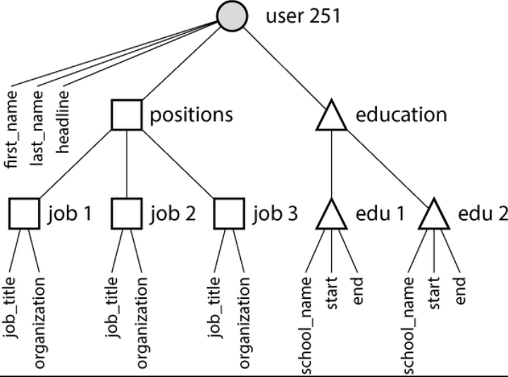

# Data Models and Query Languages

Data Models
- effect
  - how the software is written
  - how we **think about the problem** that we are solving
- software as layered data models
  - example
    - L1 — **model** the real world in terms of objects or data structures and APIs that manipulate data structures
      - e.g., money flows, sensors, ...
    - L2 — need to **store** those data structures, express them in terms of a general-purpose data model
      - such as JSON, XML documents, tables in a relational database, or vertices and edges in a graph
    - L3 — database software that decides a way of **representing** that document, relational, or graph **data** in terms of **bytes** in memory, on disk, or on a network
      - allow the data to be queried, searched, manipulated, and processed in various ways
    - L4 — hardware engineers the figure out how to **represent bytes** in terms of electrical current, pulses of light, magnetic fields, and more
  - complex application can have many more intermediary levels, but with the same **basic idea**
    - each layer hides the complexity of the layers below it by providing a clean data model
- data models
  - relational model, document model, graph-based data models, event sourcing, and DataFrames
  - some types of data and some queries are easy to express in one model and awkward in another

**Declarative Query Languages**
- many query languages are declarative
  - specify the pattern of the data you want
    - what conditions the results must meet 
    - how you want the data to be transformed (e.g., sorted, grouped, and aggregated)
    - but not **how** you achieve that goal
- in contrast, with most programming languages, you would have to write an algorithm telling the computer which operations to perform in which order

## Relational vs. Document Models

Brief evolution
- best-kown data model is **SQL**
  - data is organized into **relations** (called tables in SQL), where each realtion is an unordered collection of **tuples** (rows in SQL)
- each subsequent competitor to the relational model generated a lot of hype in its time, but none lasted
  - instead, SQL has grown to incorporate other types of data
  - e.g., adding support for XML, JSON, and graph data
- **NoSQL**
  - a single technology
    - a loose set of ideas around new data models, schema flexibility, scalability, and a move toward open source licensing models
  - one lasting effect of NoSQL is the popularity of the **document model**, which usually represents data as **JSON**
    - originally popularized by specialized document databases such as MongoDB and Couchbase
    - although most relational databases have now also added JSON support

---
### The Object-Relational Mismatch

Criticism of SQL data model
- much application development is done in **object-oriented programming languages**
- there must be an awkward translation layer between the objects in the application code and the database model of tables, rows, and columns

Object-relational mapping (**ORM**)
- frameworks that reduce the amount of biolerplate code required for the awkward transition layer
- common cited problems
  - ORMs are complex and can't completely hide the differences between the two models
  - generally used for **OLTP** app development
    - for analytics purposes, the design of the relational schema still matters when using an ORM
  - many work only with relational OLTP databases
    - systems like search engines, graph databases, and NoSQL systems might find ORM **support lacking**
  - make it easy to accidentally write inefficient queries
- advantages
  - for data well suited to a relational model
    - some kind of translation between the persistent relational and in-memory object representation is inevitable
    - ORM reduce the amount of boilerplate code required for this translation
  - some help with caching the results of database queries, which can help reduce the load on the database
  - help with managing schema migrations and other administrative activities

---
### Document data model for one-to-many relationships

Motivation
- not all data lends itself well to a relational representation
  - e.g., consider a LinkedIn profile
    - `first_name`, `last_name` appear exactly once per user, so they can be modeled as columns on the user table
    - but most people have had more than one job in their career, and people may have varying numbers of periods of education

Two approaches to represent one-to-many relationship
- one way is to put positions, education, and contact information in separate tables, each with a foreign-key reference to the `users` table
- another way is as a JSON document
  - it is perhaps more natural and more closely object structure in application code

Benefits of JSON representation
- locality
  - fetching a profile in relational example involves 
    - performing multiple queries (each table by `user_id`)
    - performing a messy multiway join between the users table and its subordinate tables
  - JSON representation have all relevant information in one place, making the query both faster and simpler
- representation of tree structure
  - one-to-many relationships from the user profile to the user's positions, education history, and contact info imply a tree structure 
  - JSON representation makes this tree structure explicit
  - **example** tree structure  
    

---
### Normalization, Denormalization, and Joins

ID vs. Text String
- for example, `region_id` vs. `Washington, DC, United States`
- advantages to have standardized list of geographic regions and let users choose from a drop-down list or autocomplete
  - consistent style and spelling
  - avoid ambiguity if several places have the same name
    - if the string were just Washington, DC, would it refer to DC or to the state?
  - ease of updating — the name is stored in only one place, it is easy to update across the board
  - localication support — when the site is translated into other languages, the standardized lists can be localized
    - so the region can be displayed in the viewer's language
  - better search functionality
    - a search for pepole on the US East Coast can match this profile, because the list of regions can encode the fact that Washington is located on the East Cost

Normalization
- whether to store an ID or a text string is a question of **normalization**
  - using an ID is more normalized: the information that is meaningful to humans is stored in only one place, and everything that refers to it uses an ID
  - when storing text directly, you are duplicating the human-meaningful information in every record that uses it
    - this representation is **denormalized**
- advantage of using an ID
  - it never needs to change
    - the ID can remain the same even if the information it identifies changes
    - anything meaningful to humans may need to change sometime in the future — and if the information is duplicated, all the redundant copies will need to be updated
- downside of normalized representation
  - every time you want to display a record containing an ID, you have to do an additional lookup to resolve the ID into something human-readable
  - i.e., **join**s
- **document databases** can store both normalized and denormalized data
  - but they are often **associated with denormalization** 
    - partly because the JSON data model makes it easy to store additional denormalized fields
    - partly because the weak support for joins in many document databases makes normalization inconvenient

Trade-offs of normalization
- motivation
  - in the LinkedIn profile example
    - `region_id` field is a reference to a standardized set of regions
    - `organizations` and `school_name` are just strings
      - these are denormalized: many people may have worked at the same company, but there is no ID linking them
  - it is worth considering whether the organization and school name should be entities instead, and the profile should reference their IDs
    - the same arguments for referencing the ID of a region also apply here
- **general principle**
  - normalized data is
    - faster to write (since there is only one copy)
    - slower to query (since it requires joins)
  - denormalized data is usually
    - faster to read (fewer joins)
    - more expensive to write (more copies to update, more disk space used)
  - additional consideration
    - need to consider the consistency of the database if a process crashes halfway through making its updates
- normalization form vs. type of system
  - normalization tends to be better for **OLTP** systems
    - where both reads and updates need to be fast
  - **analytical system** often fare better with denormalized data
    - since they perform updates in bulk
    - and the performance of read-only queries is the dominant concern
  - **small to moderate scale**
    - a normalized data model is often best because 
      - you don't have to worry about keeping multiple copies of the data consistent with one another
      - cost of performing joins is acceptable
  - **very large-scale systems**
    - cost of joins can become problematic

---
### Denormalization in the social networking case study

Normalized representation vs. denormalized one
- compare the two approaches to assemble the post timeline
  - original joins between posts and follows were too expensive, and the materialized timeline is a cache of the result of the joins
  - fan-out process that inserts a new post into followers' timelines was our way of keeping the denormalized representation consistent
- actual implementation
  - in the fan-out method, Twitter does not store the actual text of each post
  - each entry stores only 
    - the post ID
    - the ID of the user who posted it
    - a little bit of extra information to identify reposts and replies
  - this means
  - whenever the timeline is read, the service still needs to perform two joins
    - it looks up the post ID to fetch the actal post content (as well as statistics such as the number of likes and replies)
    - it looks up the sender's profile by ID (to get their username, profile picture, and other details)
- **hydrating** — the process of looking up the human-readable information by ID

Architectural choice
- reason for storing only IDs in the precomputed timeline is that the data they refer to is fast-changing
  - number of likes and replies may change multiple times per second on a popular post
  - some users regularly change their username or profile photo
- denormalizing this information into the materialized timeline would not make sense
  - since the timeline should show the latest like count and profile picture when it is viewed
  - and storage cost would be increased significantly by such denormalization
- hydrating post and user IDs is actually a fairly easy **operation to scale**
  - since it parallelizes well
  - and the cost doesn't depend on the number of accounts you are following or the number of followers you have