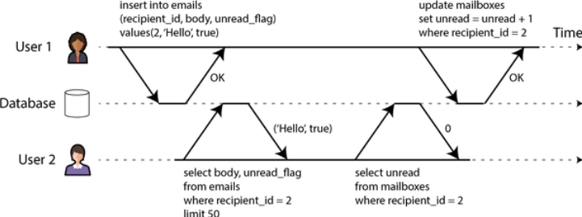
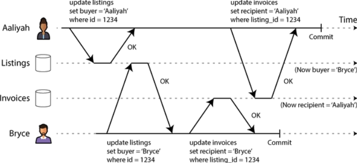
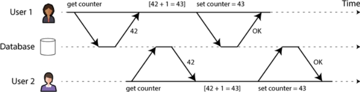
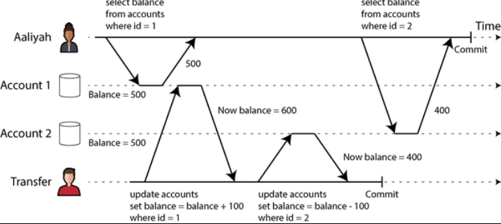

# Transactions

Motivation
- implementing **fault-tolerance** mechanisms is a lot of work
  - it requires careful thought about all the things that can go wrong and rigorous testing to ensure that the solutions that are implemented actually work
- **transactions** have been the mechanism of choice for **simplifying these issues**
  - conceptually, all the reads and writes in a transaction are **executed as one operation**
  - either 
    - the entire transaction succeeds, resulting in a **commit**
    - or it fails, resulting in an **abort** or **rollback**
  - transactions were created with a purpose: 
    - **to simplify the programming model for applications accessing a database**
    - using transactions allow applications to ignore certain potential error scenarios and concurrency issues, because the **database takes care of them** instead

## What Exactly Is a Transaction?

NoSQL movements
- nonrelational (NoSQL) databases aimed to **improve upon the relational** status quo by 
  - offering a choice of new data models
  - including replication and sharding by default
- **transacctions** were the main **casualty** of this movement
  - many of this generation of databases abandoned transactions entirely
  - or refined the word to describe a much weaker set of guarantees than had previously been understood
- the **hype around NoSQL distributed databases** led to a popular belief that 
  - **transactions were fundamentally unscalable** 
  - any large-scale system would have to abandon them in order to maintain good performance and high availability
- but recently, that belief has turned out to be **wrong**
  - "NewSQL" databases have shown that transactional systems **can scale to large data volumes and high throughput**
    - such as CockroachDB, TiDB, Spanner, FoundationDB, and YogabyteDB
  - these systems combine **sharding** with **consensus protocols** to provide strong ACID guarantees at scale

---
### The Meaning of ACID

- ACID stands for **atomocity, consistency, isolation, durability**
- one databases's impplementation of ACID does not equal another's
  - e.g., there is a lot of ambiguity around the meaning of **isolation**

Atomicity
- **in general**, atomic refers to something that cannot be broken into smaller parts
- has subtly different meanings in **different branches of computing**
  - **multithreaded programming**
    - one thread executes an atomic operation means there is no way that another thread could see the half-finished result of the operation
    - the system can be only in the state it was before the operation or after the operation, not something in between
- in the context of **ACID**
  - atomicity is not about concurrency
    - it does not describe what happens if several processes try to access the same data at the same time, that's **isolation**
  - it describes **what happens if a client wnats to make several writes, but a fault occurs after some of the writes have been processed**
- if the **writes are grouped** together into an **atomic transaction** 
  - the transaction cannot be completed (committed) because of a fault
  - the transaction is **aborted** and the database must discard or **undo any writes** it has made so far in that transaction
  - if a transaction was aborted, the application can be sure that it didn't change anything, so it **can safely be retried**

Consistency
- you have certain statements about your data (**invariants**) that must always be true
  - e.g., in an accounting system, credits and debts across all accounts must always be balanced
- rule
  - transaction **starts** with a database that is **valid** according to the invariants
  - any writes during the transaction **preserve the validity**
  - then you can be sure that the invariants are always satisfied
  - (an invariant may be **temporarily violated** during transaction execution, but it should be satisfied again at transaction commit)
- enforce
  - you need to declare them as **constraints** as part of the schema
    - e.g., foreign-key constraints, uniqueness constraints, check constraints (restrict the values that can appear in an individual row)
    - more complex consistency requirements can sometimes be modeled using **triggers** or **materialized views**
  - **not a property of the database alone**
    - if you write bad data that violates your invariants, but haven't declared those invariants, the database can't stop you
    - consistency often depends on how the application uses the database

Isolation
- **concurrency problems** (race conditions)
  - most databases are accessed by several clients at the same time
  - that's no problem if they are reading and writing different parts of the database
  - but if they are accessing same database records, you can run into concurrency problems
- isolation means that concurrently executing transactions are isolated from each other
  - they cannot step on each other's toes
- the classic database textbooks formalize isolation as **serializability**
  - means that each transaction can pretend that it is the only transaction running on the entire database
  - database ensure that when the transactions have committed, the result is the same as if they had **run serially**, even though in reality they may have **run concurrently**
- **reduce performance cost** of serializability
  - many databases use forms of isolation weaker than serializability
    - i.e., they allow concurrent transactions to interfere with each other in limited ways
  - some popular databases (Oracle) don't implement it
    - Oracle has an isolation level called "serializable" but it actually implements **snapshot isolation**, which is weaker guarantee than serializability

Durability
- durability is the promise that **after a transaction has committed successfully, any data it has written will not be forgotten**, even if there's a hardware fault or the data crashes
- in a **single-node database**, durability usually means the data has been written to nonvolatile storage such as a hard drive or SSD
  - regular file writes are usually buffered in memory before being sent to the disk sometime later
    - which means they may be lost if there is a sudden power failure
  - many databases therefore use the **fsync system call** to ensure that the data really has been written to disk
  - databases usually also have a **write-ahead log** or similar feature
    - which allows them to recover in the event that a crash occurs partway through a write
  - many databases store their data with a **checksum**
    - which allows them to detecct corrupted or incomplete log entries and thus help restore the database to a consistent snapshot after a crash
- in a **replicated database**, durability may mean that the data has been successfully copied to a certain number of nodes
  - to provide a durability guarantee, a database must wait until these writes or replications are complete before reporting a transaction as successfully committed

---
### Single-Object and Multi-Object Operations

Quick recap
- atomicity and isolation in ACID describe what the database should do if a client makes several writes within the same transaction
  - atomicity says if an error occurs halfway through a sequence of writes, the transaction should be aborted
  - isolation says concurrently running transactions shouldn't interfere with each other
- these definitions assume that you want to **modify several objects** (rows, documents, records) **at once**
- such **multi-object transactions** are often needed if several pieces of data need to be **kept in sync**

Multi-object transactions
- they require some way of determining w**hich read and write operations belong to the same transactions**
  - in **relational databases**, that is typically done based on the client's TCP connection to the database server
    - on any particular connection, everything between a `BEGIN TRANSACTION` and a `COMMIT` statement is considered to be part of the same transaction
    - if the TCP connection is interrupted, the transaction must be aborted
  - many **nonrelational databases** don't have such a way of grouping operations together
    - even if there is a multi-object API doesn't necessarily mean it has transaction semantics
      - meaning, the command may succeed for some keys and fail for others, leaving the database in a partially updated state
      - an example of multi-object API is: a key-value store that may have a multi-put operation that updates several keys in one operation

Single-object writes
- atomicity and isolation also apply when a single object is being changed
  - e.g., writing a 20 kB JSON document to a database
    - if the network connection is interrupted after the first 10 kB have been sent, does the database store that unparseable 10 kB fragment of JSON?
    - if the power fails while the database is in the middle of overwriting the previous value on disk, do you end up with the old and new values spliced together?
- storage engines hence almost universally aim to **provide atomicity and isolation** on the level of a **single object** (such as a key-value pair) **on one node**
  - **atomicity** can be implemented using a **log for crash recovery**
  - **isolation** can be implemented using a **lock** on each object (allowing only one thread to access an object at one time)
- some databases also provide **more complex atomic operations**
  - **increment operation** removes the need for a read-modify-write cycle
  - **conditional write** operation allows a write to happen only if the value has not been concurrently changed by someone else
  - **compare-and-set** or **compare-and-swap**(CAS) operation in shared-memory concurrency
- single-object operations can prevent **lost updates** when several clients try to write to the same object concurrently
  - but they are not transactions in the usual sense of the word
  - e.g., Aerospike's "strong consistency" mode and "lightweight transactions" feature of Cassandra and ScyllaDB offers **linearizable** reads and **conditional writes** on a single object
    - but no guarantees across multiple objects

The need for multi-object transactions
- in some cases, single-object inserts, updates, and deletes are sufficient
- but, in many other cases, **writes to several objects** need to be coordinated
  - relational data model and graph-like data model
    - in a relational data model, a row in one table often has a **foreign-key reference** to a row in another table
    - in a graph-like data model, a vertex has edges to other vertices
    - multi-object transactions allow you to ensure that these references remain valid
      - when inserting several records that refer to one another, the foreign keys have to be correct and up-to-date
  - document data model
    - the fields that need to be updated together are often within the same coument, which is treated as a **single object**
    - but the lack of join functionality also encourage **denormalization**
      - when denormalized information needs to be updated, you need to update several documents in one go
      - transactions are very useful in this situation to prevent denormalized data from going out of sync
  - database with **secondary indexes**
    - the indexes also need to be updated every time you change a value

Handling errors and aborts
- ACID databases are based on the transaction philosophy
  - if the database is in danger of violating its guarantee of atomicity, isolation, or durability, it would rather abandon the transaction entirely than allow it to remain half-finished
- not all systems follow this philosophy though
  - in particular, datastores with leaderless replication:
    - "the database will do as much as it can, and if it runs into an error, it won't undo something it has already done"
  - so it is the application's responsibility to recover from errors
- although retrying an aborted transaction is a simple and effective error-handling mechanism, it isn't perfect
  - if the transaction successded, but the **network was interrupted while the server tried to acknowledge the successful commit** to the client
    - so it timed out from the client's point of view
    - in this case, retrying the transaction causes it to be performed twice unless having additional application-level dedup mechanism in place
  - if the error is **due to overload** or high contention between concurrent transactions
    - retrying the transaction will make the problem worse
    - you can limit the number of retries, use exponential backoff, and handle overload-related errors differently from other errors
  - it is worth retrying only after **transient errors**, and after a **permanent error** would be pointless
    - transient errors: due to deadlock, isolation violation, temporary network interruptions, or failover
    - permanent error: constraint violation
  - if the transaction also has **side effects** outside of the database, those side effects may happen even if the transaction is aborted
    - e.g., you wouldn't want to repeatedly send the email every time you retry the transaction
    - **two-phase commit** can help make sure that several systems either commit or abort together

## Weak Isolation Levels

Motivation
- concurrency issue
  - if two transactions don't access the same data, or if both are read-only, they can safely be run in parallel, because neither depends on the other
  - concurrency issues (race conditions) come into play when 
    - one transaction reads data that is concurrently modified by another transactions
    - or when two transactions try to modify the same data
- unique difficulties
  - concurrency bugs are hard to find by testing, because such bugs are triggered only when you get unlucky with the timing
  - concurrency is also difficult to reason about, especially in a large application where you don't necessarily know which other pieces of code are accessing the db
- **transaction isolation**
  - because of the above difficulties, databases have tried to **hide concurrency issues** from application developers by providing transaction isolation
  - in theory, isolation should make life easier by letting you pretend that no concurrency is happening
    - **serializable isolation** means that the database guarantees that transactions have the same effect as if they ran serially — one at a time, without any concurrency
  - in practice, isolation is not that simple
    - serializable isolation has a **performance cost**, and many databases don't want to pay that price
    - hence, systems commonly use **weaker levels of isolation**, which protect against some concurrency issues but not all
  - concurrency bugs caused by weak transaction isolation and race conditions are not just a theoretical problem, they caused substantial loss of money
    - e.g., bankrupting a Bitcoin exchange led to investigation by financial auditors
    - caused customer data to be corrupted
  - also have to consider the possibility that an attacker might deliberately send a burst of highly concurrent requests to your API in an attempt to exploit concurrency bugs

---
### Read Commited
- it makes **two guarantees**
  - when reading from the database, you will only see data that has been commited (no dirty reads)
  - when writing to the database, you will only overwrite data that has been commited (no dirty writes)

No dirty reads
- definition
  - imagine a transaction has written some data to the database, but the transaction has not yet committed or aborted, can another transaction see that uncommitted data?
  - if so, that's called a **dirty read**
- read-committed isolation level guarantees
  - any writes by a transaction become visible to others only when that transaction commits (and then all its writes become visible at once)
- reason to prevent
  - if a transaction needs to update several rows, a dirty read means that another transaction may see some of the updates but not others
    - e.g., user 2 sees the new unread email but not the updated counter  

  - if a transaction aborts, many writes it has made need to be rolled back
    - if the database allows dirty reads, a transaction may see data that is later rolled back
    - any transaction that read uncommitted data would also need to be aborted, leading to a problem called **cascading aborts**

No dirty writes
- scenario and definition
  - what happens if two transactions concurrently try to update the same row in a database?
    - we don't know which order the writes will happen, but we normally assume that the later write overwrites the earlier one
  - what happens if the earlier write is part of a transaction that has not yet committed?
    - so the later write overwrites an uncommitted value
    - this is called a **dirty write**
- rule of thumb
  - read-commit isolation level must prevent dirty writes, usually by delaying the second write until the first write's transaction has committed or aborted
- concurrency problems avoided
  - if transactions update multiple rows, dirty writes can lead to a bad outcome
    - e.g., consider the situation where a used car sales website on which two people, Aaliyah and Bryce, are simultaneously trying to buy the same car  

      - buying a car requires two database writes
        - listing on the website needs to be updated to reflect the buyer
        - the sales invoice needs to be sent to the buyer
      - here
        - the sale is awarded to Bryce (because he performs the winning update to the listings table)
        - the invoice is sent to Aaliyah (because she performs the winning update to the invoice table)
    - read-committed isolation prevents such mishaps
  - however, read-committed isolation does not prevent the race condition between two counter increments here  

    - in this case, the second write happens after the first transaction has committed, so it is not a dirty write
    - it's still incorrect, this is an example of **lost updates**

Implementing read-committed
- read-committed is a very popular isolation level, it is the default setting in Oracle Database, PostgreSQL, SQL Server, and many other databases
- **row-level locks** — prevent **dirty writes**
  - when a transaction wants to modify a particular row, it must first acquire **a lock on that row**
    - it must then hold that lock until the transaction is committed or aborted
  - only one transaction can hold the lock for any given row
    - if another transaction wants to write to the same row, it must wait until the first transaction is committed or aborted before it can acquire the lock and continue
  - this **locking is done automatically** by databases in read-committed mode (or at stronger isolation levels)
- **dirty reads**
  - one option would be to use the same lock and to require any transaction that wants to read a row to briefly acquire the lock and then release it again immediately after reading
    - this ensure that a read couldn't happen while a row had a dirty, uncommited value
      - because during that time the lock would be held by the transaction that was making the write
      - and databases don't simply tell this read transaction that "the row is locked under earlier write transactions", the read transaction has to issue a read-lock first
    - however, requiring read locks does not work well in practice
      - one long-running write transaction can force many other transactions to wait until the long-running transaction has completed
        - even if the other transactions only read and do not write anything to the database
      - this harms the response time of read-only transactions and is bad for operability
        - a slowdown in one part of an application can have a knock-on effect in a completely different part of the application, due to waiting for locks 
  - a more commonly used approach
    - for every row that is written, the database remembers both the old committed value and the new value set by the transaction that currently holds the write block
    - while the transaction is ongoing, any other transactions that read the row are simply given the old value
    - only when the new value is committed do transactions switch over to reading the new value
  - some databases support an even weaker isolation level called **read uncommitted**
    - it prevents dirty writes but does not prevent dirty reads
    - in other words, it immediately returns the latest written value, even if the writing transaction hasn't committed yet
    - this can provide better performance, since the database does not need to store two versions of the row
    - it can also reduce the probability of (but not prevent) lost updates

---
### Snapshot Isolation and Repeatable Read

Motivation
- superficially, read-committed isolation seems to have done everything that a transaction needs to do
  - it allows aborts (required for atomicity)
  - it prevents reading the incomplete results of transactions
  - it prevents concurrent writes from getting intermingled
- however, there are many **other ways to have concurrency bugs** when using read-committed isolation level
  - scenario  

    - Aaliyah has 1k of savings at a bank, split across two accounts with 500 each
    - a transaction transfers 100 from one of her accounts to the other
    - if she looks at her list of account balances in the same moment as that transaction is being processed, she may see
      - one account balance before the incoming payment has arrived (500)
      - the other account after the outgoing transfer has been made (the new balance being 400)
    - to Aaliyah, it now appears as though she has only a total of 900 in her accounts
  - this anomaly is called **read skew**, and it is an example of **nonrepeatable read**
    - if Aaliyah were to read the balance of account 1 again at the end of the transaction, she would see a different value (600) than she saw in her previou query
  - **read skew** is considered **acceptable** under **read-committed isolation**
- in Aaliyah's case, this is not a lasting problem, but such **teporary inconsistency is not tolerable** in the following, for example
  - backups
    - taking a backup requires making a copy of the entire database, which may take hours for a large database
    - during the time that the backup process is running, writes will continue to be made to the database
    - thus, you could end up with some parts of the backup containing an older version of the data and other parts containing a newer version
    - if you need to restore from such a backup, the inconsistencies (such as disappearing money) become permanent
  - analytical queries and integrity checks
    - sometimes you may want to run a query that scans over large parts of the database
      - e.g., they may be part of a periodic integrity check that everything is in order (monitoring for data corruption)
    - these queries are likely to return nonsensical results if they observe parts of the database at different points in time
- **snapshot isolation** is the most common solution to this problem
  - the idea is that **each transaction** reads from a **consistent snapshot** of the database
    - i.e., it sees all the data that was committed in the database at the start of the transaction
    - even if the data is subsequently changed by another transaction, each transaction sees only the old data from that particular point in time
  - snapshot isolation is a boon for long-running, read-only queries such as backups and analytics
    - when a transaction can see a consistent snapshot of the database, forzen at a particular point in time, it is much easier to understand
  - snapshot isolation is a popular feature
    - variants of it are supported by PostgreSQL, MySQL with the InnoDB storage engine, Oracle, SQL Server, and others
    - although the detailed behavior varies from one system to the next

Multiversion concurrency control (MVCC)
- 